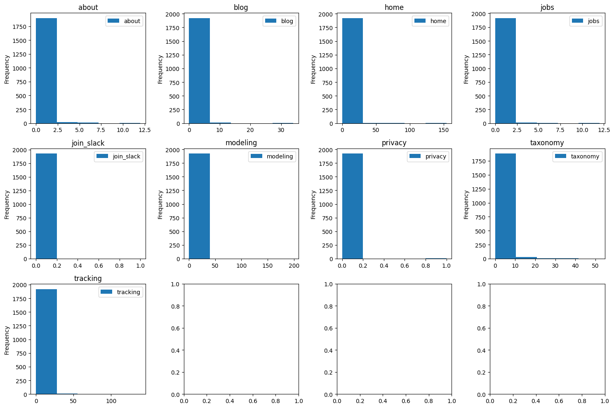

.. _example_feature_engineering:

.. frontmatterposition:: 11

.. currentmodule:: bach

=============================
Feature engineering with Bach
=============================

This example notebook shows how :doc:`modeling library Bach <../bach/index>` can be used for feature 
engineering.

It's also available as a `full Jupyter notebook 
<https://github.com/objectiv/objectiv-analytics/blob/main/notebooks/feature-engineering.ipynb>`_
to run on your own data (see how to :doc:`get started in your notebook <../get-started-in-your-notebook>`).
The dataset used here is the same as in `Objectiv Up </docs/home/up/>`__.

We'll go through describing the data, finding outliers, transforming data, and grouping & aggregating data so 
that a useful feature set is created that can be used for machine learning. To see details of how such a 
dataset can be used for machine learning with sklearn, :doc:`see our ML notebook <./machine-learning>`.

Get started
-----------
We first have to instantiate the model hub and an Objectiv DataFrame object.

.. doctest:: feature-engineering
	:skipif: engine is None

	>>> # set the timeframe of the analysis
	>>> start_date = '2022-03-01'
	>>> end_date = None

.. we override the timeframe for the doctests below
	
.. doctest:: feature-engineering
	:hide:

	>>> start_date = '2022-03-01'
	>>> end_date = '2022-03-31'
	>>> pd.set_option('display.max_colwidth', 93)

.. doctest:: feature-engineering
	:skipif: engine is None

	>>> from modelhub import ModelHub, display_sql_as_markdown
	>>> # instantiate the model hub and set the default time aggregation to daily
	>>> modelhub = ModelHub(time_aggregation='%Y-%m-%d')
	>>> # get a Bach DataFrame with Objectiv data within a defined timeframe
	>>> df = modelhub.get_objectiv_dataframe(start_date=start_date, end_date=end_date)

.. admonition:: Reference
	:class: api-reference

	* :doc:`modelhub.ModelHub <../open-model-hub/api-reference/ModelHub/modelhub.ModelHub>`
	* :doc:`modelhub.ModelHub.get_objectiv_dataframe <../open-model-hub/api-reference/ModelHub/modelhub.ModelHub.get_objectiv_dataframe>`

This object points to all data in the dataset, which is too large to run in pandas and therefore sklearn. For 
the dataset that we need, we will aggregate to user level, at which point it is small enough to fit in memory.

We'll start with showing the first couple of rows and describing the entire dataset.

Describe the data
-----------------

.. doctest:: feature-engineering
	:skipif: engine is None

	>>> df.head()
	                                             day                  moment                               user_id                                                                                location_stack              event_type                                             stack_event_types  session_id  session_hit_number
	event_id
	d4a0cb80-729c-4e17-9a42-6cb48672250f  2022-03-15 2022-03-15 08:36:33.123  005aa19c-7e80-4960-928c-a0853355ee5f  [{'id': 'about', '_type': 'RootLocationContext', '_types': ['AbstractContext', 'AbstractL...              PressEvent                 [AbstractEvent, InteractiveEvent, PressEvent]         260                   1
	75afa7bc-5237-4033-a833-bf9e0e85a3c1  2022-03-15 2022-03-15 08:36:44.625  005aa19c-7e80-4960-928c-a0853355ee5f  [{'id': 'about', '_type': 'RootLocationContext', '_types': ['AbstractContext', 'AbstractL...              PressEvent                 [AbstractEvent, InteractiveEvent, PressEvent]         260                   2
	0ae59c2c-2a2e-480c-8212-23d7aed2ae3c  2022-03-21 2022-03-21 21:15:57.671  01891784-6333-40f1-8be6-739f3adfdb97  [{'id': 'home', '_type': 'RootLocationContext', '_types': ['AbstractContext', 'AbstractLo...              PressEvent                 [AbstractEvent, InteractiveEvent, PressEvent]         356                   1
	e2d95395-e7c1-4ab1-bf32-616bb485ff02  2022-03-21 2022-03-21 21:15:58.376  01891784-6333-40f1-8be6-739f3adfdb97  [{'id': 'taxonomy', '_type': 'RootLocationContext', '_types': ['AbstractContext', 'Abstra...  ApplicationLoadedEvent  [AbstractEvent, ApplicationLoadedEvent, NonInteractiveEvent]         356                   2
	75447a30-f379-4a8f-8568-77b9cb0b5039  2022-03-21 2022-03-21 21:18:44.414  01891784-6333-40f1-8be6-739f3adfdb97  [{'id': 'home', '_type': 'RootLocationContext', '_types': ['AbstractContext', 'AbstractLo...              PressEvent                 [AbstractEvent, InteractiveEvent, PressEvent]         356                   3

Columns of interest are `user_id`, as this is what we will aggregate to, and `moment`, as this contains 
timestamp info for the events. 

See the :ref:`open taxonomy example <location-stack-and-global-contexts>` for how to use the `location_stack` 
and `global_contexts` columns.

Now let's look some more into our dataset to see what it contains.

.. doctest:: feature-engineering
	:skipif: engine is None

	>>> df.describe(include='all').head()
	               day                      moment user_id location_stack              event_type stack_event_types  session_id  session_hit_number
	__stat
	count         3619                        3619    3619           3619                    3619              3619     3619.00             3619.00
	mean          None                        None    None           None                    None              None      253.49               15.44
	std           None                        None    None           None                    None              None      134.99               23.70
	min     2022-03-01  2022-03-01 02:38:04.495000    None           None  ApplicationLoadedEvent              None        1.00                1.00
	max     2022-03-31  2022-03-31 22:53:15.035000    None           None            VisibleEvent              None      493.00              165.00

.. admonition:: Reference
	:class: api-reference

	* :doc:`bach.DataFrame.describe <../bach/api-reference/DataFrame/bach.DataFrame.describe>`
	* :doc:`bach.DataFrame.head <../bach/api-reference/DataFrame/bach.DataFrame.head>`

Create a feature set
--------------------
We'd like to create a feature set that describes the behavior of users in a certain way. We start with 
extracting the `root_location 
<https://objectiv.io/docs/taxonomy/reference/location-contexts/RootLocationContext>`_ from the location stack, 
which captures the main areas users have visited. Using `to_numpy()` shows the results as a numpy array.

.. doctest:: feature-engineering
	:skipif: engine is None

	>>> df['root_location'] = df.location_stack.ls.get_from_context_with_type_series(type='RootLocationContext', key='id')
	>>> # root series is later unstacked and its values might contain dashes
	>>> # which are not allowed in BigQuery column names, lets replace them
	>>> df['root_location'] = df['root_location'].str.replace('-', '_')
	>>> df.root_location.unique().to_numpy()
	array(['about', 'blog', 'home', 'jobs', 'join_slack', 'modeling',
	       'privacy', 'taxonomy', 'tracking'], dtype=object)

This returns `['jobs', 'docs', 'home'...]` etc., which in this example are the sections of the objectiv.io 
website.

Check any missing values
~~~~~~~~~~~~~~~~~~~~~~~~

.. doctest:: feature-engineering
	:skipif: engine is None

	>>> df.root_location.isnull().value_counts().head()
	root_location
	False    3619
	Name: value_counts, dtype: int64

This shows us that there are no missing values to worry about. Now we want a dataset with interactions on our different sections. In particular, PressEvents, an event type. We first want an overview of the different event types that exist and select the one we are interested in.

.. doctest:: feature-engineering
	:skipif: engine is None

	>>> df.event_type.unique().to_numpy()
	array(['MediaPauseEvent', 'MediaStartEvent', 'PressEvent',
	       'MediaLoadEvent', 'SuccessEvent', 'VisibleEvent',
	       'ApplicationLoadedEvent', 'HiddenEvent', 'MediaStopEvent'],
	      dtype=object)

We are interested in all `PressEvent` event types:

.. doctest:: feature-engineering
	:skipif: engine is None

	>>> df[(df.event_type=='PressEvent')].root_location.unique().to_numpy()
	array(['about', 'blog', 'home', 'jobs', 'modeling', 'privacy', 'taxonomy',
	       'tracking'], dtype=object)

.. doctest:: feature-engineering
	:skipif: engine is None

	>>> df[(df.event_type=='PressEvent')].describe(include='string').head()
	         event_type root_location
	__stat
	count          1041          1041
	min      PressEvent         about
	max      PressEvent      tracking
	nunique           1             8
	mode     PressEvent          home

Create the variables
~~~~~~~~~~~~~~~~~~~~

Here we select only PressEvents and then group by `user_id` & `root`, and count the session_hit_number. After 
that the results are unstacked, resulting in a table where each row represents a user (the index is 
`user_id`), the columns are the different root_locations, and its values are the number of times a user 
clicked in those sections.

.. doctest:: feature-engineering
	:skipif: engine is None

	>>> features = df[(df.event_type=='PressEvent')].groupby(['user_id','root_location']).session_hit_number.count()

.. doctest:: feature-engineering
	:skipif: engine is None

	>>> features_unstacked = features.unstack()

.. doctest:: feature-engineering
	:skipif: engine is None

	>>> features_unstacked.materialize().describe().head()
	        about   blog    home   jobs  modeling  privacy  taxonomy  tracking
	__stat
	count   48.00  33.00  148.00  27.00     24.00      1.0     20.00     24.00
	mean     1.44   1.82    3.36   1.59      7.17      1.0      3.75      5.17
	std      1.65   1.78    4.70   1.12      9.37      NaN      3.52      6.82
	min      1.00   1.00    1.00   1.00      1.00      1.0      1.00      1.00
	max     12.00  10.00   28.00   6.00     38.00      1.0     13.00     26.00

.. doctest:: feature-engineering
	:skipif: engine is None

	>>> features_unstacked.head()
	                                      about  blog  home  jobs modeling privacy  taxonomy tracking
	user_id
	005aa19c-7e80-4960-928c-a0853355ee5f    2.0  None   NaN   NaN     None    None       NaN     None
	01891784-6333-40f1-8be6-739f3adfdb97    NaN  None   9.0   NaN     None    None       2.0     None
	031943b0-d8a9-4efc-a111-525fe56a619f    1.0  None   1.0   2.0     None    None       NaN     None
	068e5bb3-00c5-4b2d-a4c3-71632d5fb9a3    NaN  None   1.0   NaN     None    None       NaN     None
	0b7fa533-64ca-48c9-84d9-04c54b0fa069    NaN  None   7.0   NaN     None    None       NaN     None

Fill empty values
~~~~~~~~~~~~~~~~~

Now we do have empty values, so we fill them with 0, as empty means that the user did not click in the 
section.

.. doctest:: feature-engineering
	:skipif: engine is None

	>>> features_unstacked = features.unstack(fill_value=0)

Describe the dataset again
~~~~~~~~~~~~~~~~~~~~~~~~~~~

We use describe again to get an impression of out created per-user dataset.

.. doctest:: feature-engineering
	:skipif: engine is None

	>>> features_unstacked.materialize().describe().head()
	         about    blog    home    jobs  modeling  privacy  taxonomy  tracking
	__stat
	count   162.00  162.00  162.00  162.00    162.00   162.00    162.00    162.00
	mean      0.43    0.37    3.07    0.27      1.06     0.01      0.46      0.77
	std       1.11    1.08    4.59    0.75      4.37     0.08      1.73      3.17
	min       0.00    0.00    0.00    0.00      0.00     0.00      0.00      0.00
	max      12.00   10.00   28.00    6.00     38.00     1.00     13.00     26.00

Looking at the mean, some `root_locations` seem to be used a lot more than others. Also, the max number of 
clicks seems quite different per `root_location`. This information can be used to drop some of the variables 
from our dataset, or to use scaling or outlier detection. We will plot histograms for this.

Visualize the data
~~~~~~~~~~~~~~~~~~

.. doctest:: feature-engineering
	:skipif: engine is None
	:options: +ELLIPSIS

	>>> from matplotlib import pyplot as plt
	>>> import math
	>>> figure, axis = plt.subplots(math.ceil(len(features_unstacked.data_columns)/4), 4, figsize=(15,10))
	>>> for idx, name in enumerate(features_unstacked.data_columns):
	...     features_unstacked[[name]].plot.hist(bins=5, title=name, ax=axis.flat[idx])
	<AxesSubplot: ...>
	>>> plt.tight_layout()

The histograms show that indeed the higher values seem quite anomalous for most of the root_locations. This 
could be a reason to drop some of these observations, or resort to scaling methods. For now we continue with 
the dataset as is.

Add time feature
~~~~~~~~~~~~~~~~

Now we want to add the time feature to our dataset. We'll add the average session length per user for that,
using `fillna` to fill missing values.

.. doctest:: feature-engineering
	:skipif: engine is None

	>>> import datetime
	>>> features_unstacked['session_duration'] = modelhub.aggregate.session_duration(df, groupby='user_id')
	>>> features_unstacked['session_duration'] = features_unstacked['session_duration'].fillna(datetime.timedelta(0))

.. doctest:: feature-engineering
	:skipif: engine is None

	>>> features_unstacked.session_duration.describe().head()
	__stat
	count                          162
	mean       0 days, 00:03:22.621270
	min        0 days, 00:00:00.000000
	max        0 days, 00:29:16.800000
	nunique                        144
	Name: session_duration, dtype: object

.. admonition:: Reference
	:class: api-reference

	* :ref:`Using global context data <location-stack-and-global-contexts>`
	* :doc:`modelhub.SeriesLocationStack.ls <../open-model-hub/api-reference/SeriesLocationStack/modelhub.SeriesLocationStack.ls>`
	* :doc:`bach.Series.unique <../bach/api-reference/Series/bach.Series.unique>`
	* :doc:`bach.Series.to_numpy <../bach/api-reference/Series/bach.Series.to_numpy>`
	* :doc:`bach.DataFrame.describe <../bach/api-reference/DataFrame/bach.DataFrame.describe>`
	* :doc:`bach.DataFrame.head <../bach/api-reference/DataFrame/bach.DataFrame.head>`
	* :doc:`bach.Series.count <../bach/api-reference/Series/bach.Series.count>`
	* :doc:`bach.DataFrame.count <../bach/api-reference/DataFrame/bach.DataFrame.count>`
	* :doc:`bach.DataFrame.materialize <../bach/api-reference/DataFrame/bach.DataFrame.materialize>`
	* :doc:`bach.DataFrame.unstack <../bach/api-reference/DataFrame/bach.DataFrame.unstack>`
	* :doc:`modelhub.Aggregate.session_duration <../open-model-hub/models/aggregation/modelhub.Aggregate.session_duration>`
	* :doc:`bach.DataFrame.fillna <../bach/api-reference/DataFrame/bach.DataFrame.fillna>`

Export to pandas for sklearn
----------------------------
Now that we have our dataset, we can use it for machine learning, e.g. with sklearn. To do so, we call 
`to_pandas()` to get a pandas DataFrame that can be used in sklearn.

Also :doc:`see the example notebook on how to use Objectiv data and sklearn <./machine-learning>`.

.. doctest:: feature-engineering
	:skipif: engine is None

	>>> pdf = features_unstacked.to_pandas()
	>>> pdf
	                                      about  blog  home  jobs  modeling  privacy  taxonomy  tracking       session_duration
	user_id
	005aa19c-7e80-4960-928c-a0853355ee5f      2     0     0     0         0        0         0         0 0 days 00:00:11.502000
	01891784-6333-40f1-8be6-739f3adfdb97      0     0     9     0         0        0         2         0        0 days 00:11:33
	031943b0-d8a9-4efc-a111-525fe56a619f      1     0     1     2         0        0         0         0 0 days 00:04:50.600000
	068e5bb3-00c5-4b2d-a4c3-71632d5fb9a3      0     0     1     0         0        0         0         0        0 days 00:00:00
	0b7fa533-64ca-48c9-84d9-04c54b0fa069      0     0     7     0         0        0         0         0 0 days 00:01:19.056000
	...                                     ...   ...   ...   ...       ...      ...       ...       ...                    ...
	f885c01d-5bfd-422e-aef5-8d04f2602927      0     0     2     0         0        0         0         0 0 days 00:01:08.091000
	f8bc663c-c83b-4e33-9ae0-f984f6eb1a09      0     0     7     0         2        0         0         0 0 days 00:06:13.484000
	f8fc2575-1272-4781-b1ed-11b6c9083ac3      0     0     2     0         0        0         0         0 0 days 00:00:13.428000
	fc4389c3-6931-4323-ba38-211d5eb4874d      2     0     2     0         0        0         0         0 0 days 00:01:35.546000
	ff48d79a-195a-476a-b49d-0e212de43c96      0     0     4     1         0        0         0         0 0 days 00:00:57.196500
	<BLANKLINE>
	[162 rows x 9 columns]

.. admonition:: Reference
	:class: api-reference

	* :doc:`bach.DataFrame.to_pandas <../bach/api-reference/DataFrame/bach.DataFrame.to_pandas>`

Get the SQL for any analysis
----------------------------

The SQL for any analysis can be exported with one command, so you can use models in production directly to 
simplify data debugging & delivery to BI tools like Metabase, dbt, etc. See how you can `quickly create BI 
dashboards with this <https://objectiv.io/docs/home/up#creating-bi-dashboards>`_.

.. exec_code::
	:language: jupyter-notebook
	:language_output: jupyter-notebook-out

	# --- hide: start ---
	import os
	import datetime
	from modelhub import ModelHub
	modelhub = ModelHub(time_aggregation='%Y-%m-%d')
	DB_URL = os.environ.get('OBJ_DB_PG_TEST_URL', 'postgresql://objectiv:@localhost:5432/objectiv')
	df = modelhub.get_objectiv_dataframe(db_url=DB_URL, start_date='2022-03-01', end_date='2022-03-31')
	df['root_location'] = df.location_stack.ls.get_from_context_with_type_series(type='RootLocationContext', key='id').str.replace('-', '_')
	features = df[(df.event_type=='PressEvent')].groupby(['user_id','root_location']).session_hit_number.count()
	features_unstacked = features.unstack(fill_value=0)
	features_unstacked['session_duration'] = modelhub.aggregate.session_duration(df, groupby='user_id').fillna(datetime.timedelta(0))
	def display_sql_as_markdown(arg): [print('sql\n' + arg.view_sql() + '\n')]
	# --- hide: stop ---
	# show the underlying SQL for this dataframe - works for any dataframe/model in Objectiv
	display_sql_as_markdown(features_unstacked)

That's it! `Join us on Slack <https://objectiv.io/join-slack>`_ if you have any questions or suggestions.

Next Steps
----------

Try the notebooks in Objectiv Up
~~~~~~~~~~~~~~~~~~~~~~~~~~~~~~~~

Spin up a full-fledged product analytics pipeline with `Objectiv Up </docs/home/up>`__ in under 5 minutes, 
and play with the included example notebooks yourself.

Use this notebook with your own data
~~~~~~~~~~~~~~~~~~~~~~~~~~~~~~~~~~~~

You can use the example notebooks on any dataset that was collected with Objectiv's tracker, so feel free to 
use them to bootstrap your own projects. They are available as Jupyter notebooks on our `GitHub repository 
<https://github.com/objectiv/objectiv-analytics/tree/main/notebooks>`_. See `instructions to set up the 
Objectiv tracker <https://objectiv.io/docs/tracking/>`_. 

Check out related example notebooks
~~~~~~~~~~~~~~~~~~~~~~~~~~~~~~~~~~~

* :doc:`Bach and sklearn <./machine-learning>` - see how you can do all your analysis and Machine Learning 
	directly on the raw data in your SQL database with Objectiv.
