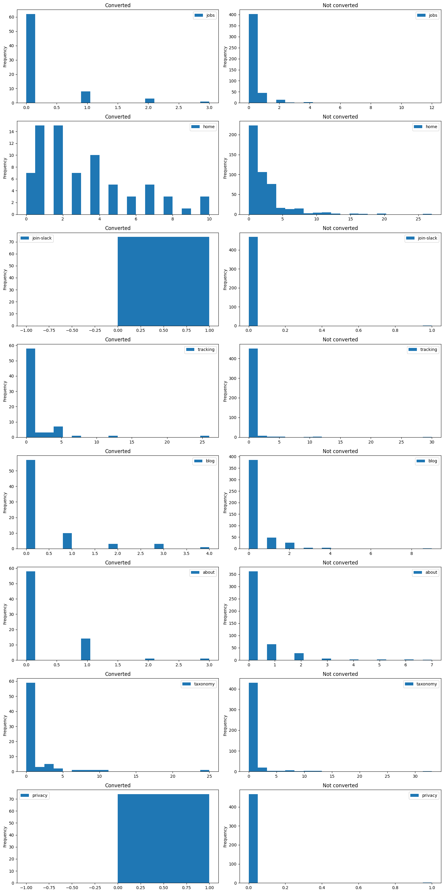
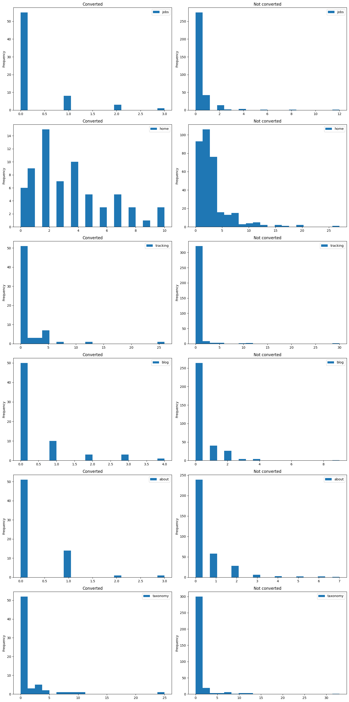

.. _feature_importance:

.. frontmatterposition:: 6

.. currentmodule:: bach

===========================
Modeling feature importance
===========================

This example notebook shows how you can use the open model hub to model the importance of features on 
achieving a conversion goal. Such features can be any interactions with your product's content. The model to 
run this directly using the open model hub is currently still in development; `see the draft PR 
<https://github.com/objectiv/objectiv-analytics/pull/662/>`_. 

The dataset used here is the same as in `Objectiv Up </docs/home/up/>`__. To run this on your own data, see 
how to :doc:`get started in your notebook <../get-started-in-your-notebook>`.

Get started
-----------
We first have to instantiate the model hub and an Objectiv DataFrame object.

.. doctest::
	:skipif: engine is None

	>>> # set the timeframe of the analysis
	>>> start_date = '2022-06-01'
	>>> end_date = None

.. we override the timeframe for the doctests below
	
.. testsetup:: feature-importance
	:skipif: engine is None

	start_date = '2022-02-15'
	end_date = '2022-05-16'

.. doctest:: feature-importance
	:skipif: engine is None

	>>> # instantiate the model hub, set the default time aggregation to daily
	>>> # and get the application & path global contexts
	>>> from matplotlib import pyplot as plt
	>>> from modelhub import ModelHub, display_sql_as_markdown
	>>> modelhub = ModelHub(time_aggregation='%Y-%m-%d', global_contexts=['root_location'])
	>>> # get an Objectiv DataFrame within a defined timeframe
	>>> df = modelhub.get_objectiv_dataframe(db_url=DB_URL, start_date=start_date, end_date=end_date)

.. admonition:: Reference
	:class: api-reference

	* :doc:`modelhub.ModelHub.get_objectiv_dataframe <../open-model-hub/api-reference/ModelHub/modelhub.ModelHub.get_objectiv_dataframe>`

Define features & conversion
----------------------------

First we have to define the conversion goal that we are predicting, as well as the features that we want to
use as predictors.

For this example, we define the conversion goal as reaching the :doc:`modeling section <../index>` in our 
documentation. We want to model the impact of users clicking/pressing in any of the main sections 
(`root locations <http://objectiv.io/docs/taxonomy/reference/location-contexts/RootLocationContext>`_) in 
our website. This works for our example, as there are only a limited amount of root locations in the dataset, 
and we make an assumption that there is as causal relation between the number of clicks in these root 
locations and conversion. Make sure to think of this assumption when using this model on your own data.

.. doctest:: feature-importance
	:skipif: engine is None

	>>> # define which events to use as conversion events
	>>> df['use_modeling'] = modelhub.add_conversion_event(data=df, location_stack=df.location_stack.json[{'id': 'modeling', '_type': 'RootLocationContext'}:], event_type='PressEvent', name='use_modeling')
	>>> # the features that we use for predicting
	>>> df['root'] = df.location_stack.ls.get_from_context_with_type_series(type='RootLocationContext', key='id')
	>>> df.head()
	                                             day                  moment                               user_id                                                                                location_stack              event_type                                             stack_event_types  session_id  session_hit_number root_location  use_modeling   root
	event_id                                                                                                                                                                                                                                                                                                                                                             
	d4a0cb80-729c-4e17-9a42-6cb48672250f  2022-03-15 2022-03-15 08:36:33.123  005aa19c-7e80-4960-928c-a0853355ee5f  [{'id': 'about', '_type': 'RootLocationContext', '_types': ['AbstractContext', 'AbstractL...              PressEvent                 [AbstractEvent, InteractiveEvent, PressEvent]         260                   1            []         False  about
	75afa7bc-5237-4033-a833-bf9e0e85a3c1  2022-03-15 2022-03-15 08:36:44.625  005aa19c-7e80-4960-928c-a0853355ee5f  [{'id': 'about', '_type': 'RootLocationContext', '_types': ['AbstractContext', 'AbstractL...              PressEvent                 [AbstractEvent, InteractiveEvent, PressEvent]         260                   2            []         False  about
	dfd0f458-3f81-43d5-a5ce-4696e4429113  2022-05-05 2022-05-05 07:14:47.345  007f5fd7-7535-434e-aa3e-3d52f06d63ce  [{'id': 'about', '_type': 'RootLocationContext', '_types': ['AbstractContext', 'AbstractL...  ApplicationLoadedEvent  [AbstractEvent, ApplicationLoadedEvent, NonInteractiveEvent]        1115                   1            []         False  about
	fd7c9b06-ea9d-4cf7-9538-3373a04172cd  2022-05-05 2022-05-05 07:15:16.612  007f5fd7-7535-434e-aa3e-3d52f06d63ce  [{'id': 'about', '_type': 'RootLocationContext', '_types': ['AbstractContext', 'AbstractL...  ApplicationLoadedEvent  [AbstractEvent, ApplicationLoadedEvent, NonInteractiveEvent]        1115                   2            []         False  about
	2865beed-f191-467a-9359-7f1d858f6638  2022-04-14 2022-04-14 21:17:36.140  00b011eb-74ee-4d01-a00f-36617c6a0ee1  [{'id': 'home', '_type': 'RootLocationContext', '_types': ['AbstractContext', 'AbstractLo...  ApplicationLoadedEvent  [AbstractEvent, ApplicationLoadedEvent, NonInteractiveEvent]         684                   1            []         False   home

We estimate conversion by using the number of presses in each root location with a logistic regression model. 
The coefficients of this regression can be interpreted as the contribution to conversion (direction and 
magnitude).

Next, we instantiate the dataset and untrained model.

.. code-block:: jupyter-notebook
	
	>>> # define which events to use as conversion events
	>>> X_temp, y_temp, model = modelhub.agg.feature_importance(data=df[df.event_type=='PressEvent'], name='use_modeling', feature_column='root')

This lets you adjust the dataset further, or use the model as-is:

- `y_temp` is a BooleanSeries that indicates conversion per user. 
- `X_temp` is a DataFrame with the number of presses per `user_id`. For users that converted in the selected 
	dataset, only usage from _before_ reaching conversion is counted. 
- The `model` is the toolkit that can be used to assess the feature importance on our conversion goal.

.. code-block:: jupyter-notebook
	
	>>> y_temp.head()

.. code-block:: jupyter-notebook-out
	
	user_id
	005aa19c-7e80-4960-928c-a0853355ee5f    False
	0115c0f1-1145-49bd-80a5-66f4548a7a39    False
	01891784-6333-40f1-8be6-739f3adfdb97    False
	021f2c2f-f441-4e11-875c-20dc27aaf57e    False
	02c42c27-1c0d-4e3e-b6c0-403a60e8eb83    False
	Name: is_converted, dtype: bool

.. code-block:: jupyter-notebook
	
	>>> X_temp.head()

.. code-block:: jupyter-notebook-out
	
	                                      jobs home join-slack tracking blog about taxonomy privacy
	user_id
	005aa19c-7e80-4960-928c-a0853355ee5f  0    0    0          0        0    2     0        0
	0115c0f1-1145-49bd-80a5-66f4548a7a39  0    1    0          0        0    0     0        0
	01891784-6333-40f1-8be6-739f3adfdb97  0    9    0          0        0    0     2        0
	021f2c2f-f441-4e11-875c-20dc27aaf57e  1    3    0          0        1    1     0        0
	02c42c27-1c0d-4e3e-b6c0-403a60e8eb83  0    0    0          0        0    0     3        0

In our example, we will go into detailed assessment of the model's accuracy, so we won't jumpt to the model 
results, but instead first look at our data set and prepare a proper data set for the model.

.. code-block:: jupyter-notebook

	>>> data_set_temp = X_temp.copy()
	>>> # we save the columns that are in our dataset, these will be used later.
	>>> columns = X_temp.data_columns
	>>> data_set_temp['is_converted'] = y_temp
	>>> data_set_temp['total_press'] = modelhub.map.sum_feature_rows(X_temp)

.. admonition:: Reference
	:class: api-reference

	* :doc:`modelhub.ModelHub.add_conversion_event <../open-model-hub/api-reference/ModelHub/modelhub.ModelHub.add_conversion_event>`
	* :doc:`modelhub.SeriesLocationStack.ls <../open-model-hub/api-reference/SeriesLocationStack/modelhub.SeriesLocationStack.ls>`
	* :doc:`bach.DataFrame.head <../bach/api-reference/DataFrame/bach.DataFrame.head>`
	* :doc:`bach.DataFrame.copy <../bach/api-reference/DataFrame/bach.DataFrame.copy>`

Review the dataset
------------------

For a logistic regression, several assumptions such as sample size, no influential outliers, and linear
relation between the features and the logit of the goal should be fulfilled. We'll first look at our data to
get the best possible dataset for our model.

.. code-block:: jupyter-notebook

	>>> data_set_temp.describe().head()

.. code-block:: jupyter-notebook-out

	       jobs   home join-slack tracking blog   about  taxonomy privacy total_press
	__stat
	 count 543.00 543.00   543.00   543.00 543.00 543.00   543.00  543.00      543.00
	  mean   0.25   2.59     0.00     0.42   0.31   0.37     0.65    0.00        4.59
	   std   0.87   2.94     0.04     2.12   0.80   0.86     2.51    0.06        5.14
	   min   0.00   0.00     0.00     0.00   0.00   0.00     0.00    0.00        1.00
	   max  12.00  27.00     1.00    30.00   9.00   7.00    33.00    1.00       45.00

This shows that we have 543 samples in our data. It also shows that the mean is quite low for most features, 
and the same is true for the standard deviation. This indicates that the feature usage is not distributed
very well.

.. code-block:: jupyter-notebook

	>>> data_set_temp.is_converted.value_counts().head()

.. code-block:: jupyter-notebook-out

	is_converted
	False    469
	True      74
	Name: value_counts, dtype: int64

.. code-block:: jupyter-notebook

	>>> (data_set_temp.is_converted.value_counts()/data_set_temp.is_converted.count()).head()

.. code-block:: jupyter-notebook-out

	is_converted
	False    0.86372
	True     0.13628
	Name: value_counts, dtype: float64

The dataset is not balanced in terms of users that did or did not reach conversion: 74 converted users 
(13.6%). While this is not necessarily a problem, it influences the metric we choose to look at for model
performance. The model that we instantiated already accommodates for this.

We can also plot histograms of the features, so we can inspect the distributions more closely.

.. code-block:: jupyter-notebook

	>>> figure, axis = plt.subplots(len(columns), 2, figsize=(15,30))
	>>> 
	>>> for idx, name in enumerate(columns):
	>>> 	data_set_temp[data_set_temp.is_converted==True][[name]].plot.hist(bins=20, title='Converted', ax=axis[idx][0])
	>>> 	data_set_temp[data_set_temp.is_converted==False][[name]].plot.hist(bins=20, title='Not converted', ax=axis[idx][1])
	>>> plt.tight_layout()

We see that some features are not useful at all ('join-slack' and 'privacy'), so we will remove them. Moreover
we think that users that clicking only once in any of the root locations will not provide us with any
explanatory behavior for the goal. Those users might, for instance, be users that wanted to go to our 
modeling section, and this was the quickest way to get there with the results Google provided them. In that 
case, the intent of the user (something of which we can never be 100% sure), was going to the modeling 
section. The _features_ did not convince them.

By filtering like this, it is more likely that the used features on our website did, or did not convince a
user to check out the modeling section of our docs. This is exactly what we are after. An additional
advantage is that the distribution of feature usage will most likely get more favorable after removing
1-press-users.

.. code-block:: jupyter-notebook

	>>> # remove useless features.
	>>> data_set_temp = data_set_temp.drop(columns=['privacy', 'join-slack'])
	>>> # we update the columns that are still in our dataset.
	>>> columns = [x for x in data_set_temp.data_columns if x in X_temp.data_columns]
	>>> # only use users with at least more than 1 press.
	>>> data_set_temp = data_set_temp[data_set_temp.total_press>1]

If we now rerun the code above to review the dataset we find that the dataset is more balanced (16.5%
converted), although it is a bit small now (406 samples). The distributions as shown by describing the data
set and the histograms look indeed better for our model now. We will use this dataset to create our X and
y dataset that we will use in the model.

.. code-block:: jupyter-notebook

	>>> data_set_temp.describe().head()

.. code-block:: jupyter-notebook-out

	jobs   home    tracking blog about taxonomy total_press
	__stat
	 count  406.00 406.00 406.00 406.00 406.00 406.00 406.00
	  mean    0.32   3.20   0.56   0.39   0.47   0.85   5.80
	   std    0.99   3.17   2.43   0.90   0.97   2.87   5.43
	   min    0.00   0.00   0.00   0.00   0.00   0.00   2.00
	   max   12.00  27.00  30.00   9.00   7.00  33.00  45.00

.. code-block:: jupyter-notebook

	>>> data_set_temp.is_converted.value_counts().head()

.. code-block:: jupyter-notebook-out

	is_converted
	False    339
	True      67
	Name: value_counts, dtype: int64

.. code-block:: jupyter-notebook

	>>> (data_set_temp.is_converted.value_counts()/data_set_temp.is_converted.count()).head()

.. code-block:: jupyter-notebook-out

	is_converted
	False    0.834975
	True     0.165025
	Name: value_counts, dtype: float64

.. code-block:: jupyter-notebook

	>>> figure, axis = plt.subplots(len(columns), 2, figsize=(15,30))
	>>> 
	>>> for idx, name in enumerate(columns):
	>>>     data_set_temp[data_set_temp.is_converted==True][[name]].plot.hist(bins=20, title='Converted', ax=axis[idx][0])
	>>>     data_set_temp[data_set_temp.is_converted==False][[name]].plot.hist(bins=20, title='Not converted', ax=axis[idx][1])
	>>> plt.tight_layout()

.. code-block:: jupyter-notebook

	>>> X = data_set_temp[columns]
	>>> y = data_set_temp.is_converted

.. admonition:: Reference
	:class: api-reference

	* :doc:`bach.DataFrame.describe <../bach/api-reference/DataFrame/bach.DataFrame.describe>`
	* :doc:`bach.DataFrame.head <../bach/api-reference/DataFrame/bach.DataFrame.head>`
	* :doc:`bach.Series.value_counts <../bach/api-reference/Series/bach.Series.value_counts>`
	* :doc:`bach.Series.count <../bach/api-reference/Series/bach.Series.count>`
	* :doc:`bach.DataFrame.drop <../bach/api-reference/DataFrame/bach.DataFrame.drop>`

Train and evaluate the model
----------------------------
As mentioned above, the model is based on logistic regression. Logistic regression seems sensible as it is
used for classification, but also has relatively easy to interpret coefficients for the features. The
feature importance model uses the AUC to assess the performance. This is because we are more interested in
the coefficients than the actual predicted labels, and also because this metric can handle imbalanced 
datasets. 

The feature importance model by default trains a logistic regression model three times on the entire
dataset split in threefolds. This way we can not only calculate the AUC on one test after training the model, 
but also see whether the coefficients for the model are relatively stable when trained on different
data. After fitting the model, the results (the average coefficients of the three models) as well as the
performance of the three models can be retrieved with `model` methods.

.. code-block:: jupyter-notebook

	>>> # train the model
	>>> model.fit(X, y, seed=.4)
	>>> model.results()

.. code-block:: jupyter-notebook-out

	         coefficients_mean coefficients_std
	about            -0.403494         0.105327
	jobs             -0.016932         0.101370
	home              0.033575         0.017482
	taxonomy          0.084558         0.042645
	blog              0.095825         0.104930
	tracking          0.170703         0.107747

The mean of the coefficients are returned together with the standard deviation. The lower the standard
deviation, the more stable the coefficients in the various runs. Our results show that 'about' has most
negative impact on conversion, while 'tracking', 'blog' and 'taxonomy' has the most positive impact.

.. code-block:: jupyter-notebook

	>>> model.auc()

.. code-block:: jupyter-notebook-out

	0.6935796984854313

The average AUC of our models is 0.69. This is better than a baseline model (0.5 AUC). However, it also
means that it is not a perfect model and therefore the chosen features alone cannot predict conversion 
completely.

Amongst others, some things that might improve further models are a larger dataset, other explanatory
variables (i.e. more detailed locations instead of only root locations), and more information on the users
(i.e. user referrer as a proxy for user intent).

.. code-block:: jupyter-notebook

	>>> model.results(full=True)

.. code-block:: jupyter-notebook-out

	       jobs     home tracking     blog     about taxonomy
	0  0.086162 0.013394 0.078106 0.212065 -0.458034 0.053494
	0 -0.020472 0.043257 0.288966 0.067309 -0.282082 0.133179
	0 -0.116485 0.044074 0.145039 0.008101 -0.470368 0.067001

Get the SQL for any analysis
----------------------------

The SQL for any analysis can be exported with one command, so you can use models in production directly to 
simplify data debugging & delivery to BI tools like Metabase, dbt, etc. See how you can `quickly create BI 
dashboards with this <https://objectiv.io/docs/home/up#creating-bi-dashboards>`_.

That's it! The model to run this directly using the open model hub is currently still in development; 
`see the draft PR <https://github.com/objectiv/objectiv-analytics/pull/662/>`_. 

`Join us on Slack <https://objectiv.io/join-slack>`_ if you have any questions or suggestions.

Next Steps
----------

Try the notebooks in Objectiv Up
~~~~~~~~~~~~~~~~~~~~~~~~~~~~~~~~

Spin up a full-fledged product analytics pipeline with `Objectiv Up </docs/home/up>`__ in under 5 minutes, 
and play with the included example notebooks yourself.

Check out related example notebooks
~~~~~~~~~~~~~~~~~~~~~~~~~~~~~~~~~~~

* :doc:`Basic User Intent notebook <./user-intent>` - easily run basic User Intent analysis with Objectiv.
