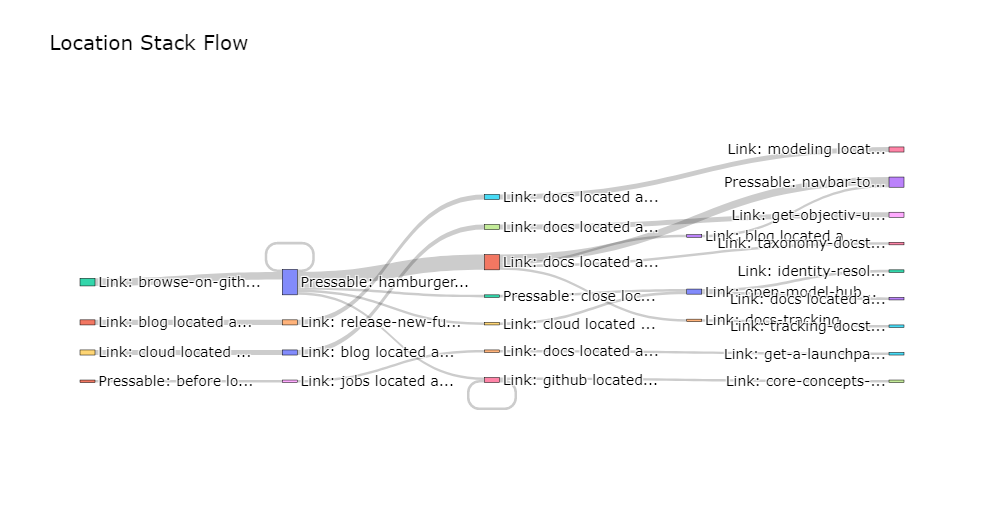
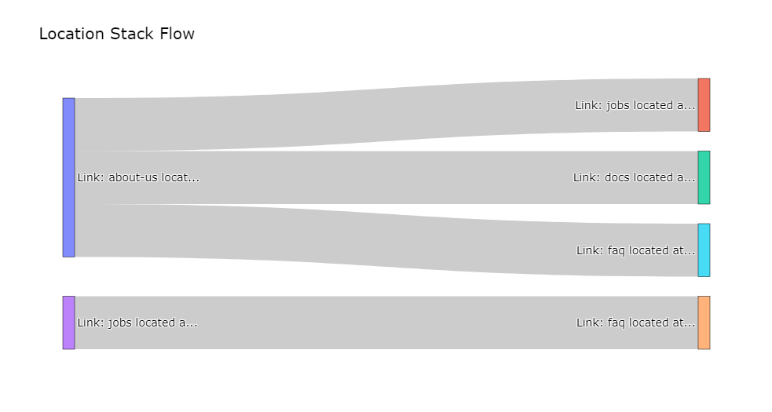

.. _funnel_discovery:

.. frontmatterposition:: 4

.. currentmodule:: bach

================
Funnel Discovery
================

This example notebook shows how to use the 'Funnel Discovery' model on your data collected with Objectiv. 
It's also available as a `full Jupyter notebook 
<https://github.com/objectiv/objectiv-analytics/blob/main/notebooks/funnel-discovery.ipynb>`_
to run on your own data (see how to :doc:`get started in your notebook <../get-started-in-your-notebook>`), 
or you can instead `run Objectiv Up </docs/home/up/>`__ to try it out. The dataset used here is the same as in 
Up.

In classical funnel analysis you predefine the steps, and then you analyze the differences for user 
attributes or behavior in each step.

However, this means you have to make assumptions about which steps matter, and you potentially miss important, 
impactful flows, e.g. because they are not very obvious or still small. Yet these can represent major 
opportunities to boost or optimize.

This is where Funnel Discovery comes in: to discover all the (top) user journeys that lead to conversion or 
drop-off, and run subsequent analyses on them.

In particular, we will discover in this example:

* The most popular consecutive steps overall;
* The steps/flows which lead to conversion;
* The most common drop-offs;
* The user journeys from marketing campaigns;
* Etcetera.

Get started
-----------
We first have to instantiate the model hub and an Objectiv DataFrame object.

.. doctest::
	:skipif: engine is None

	>>> # set the timeframe of the analysis
	>>> start_date = '2022-07-01'
	>>> end_date = None

.. we override the timeframe for the doctests below
	
.. testsetup:: funnel-discovery
	:skipif: engine is None

	start_date = '2022-07-01'
	end_date = '2022-07-30'
	pd.set_option('display.max_colwidth', 93)

.. doctest:: funnel-discovery
	:skipif: engine is None

	>>> # instantiate the model hub, and set the default time aggregation to daily
	>>> # and set the global contexts that will be used in this example
	>>> from modelhub import ModelHub
	>>> modelhub = ModelHub(time_aggregation='%Y-%m-%d', global_contexts=['application', 'marketing'])
	>>> # get an Objectiv DataFrame within a defined timeframe
	>>> df = modelhub.get_objectiv_dataframe(db_url=DB_URL, start_date=start_date, end_date=end_date)

The `location_stack` column, and the columns taken from the global contexts, contain most of the 
event-specific data. These columns are JSON typed, and we can extract data from it using the keys of the JSON 
objects with :doc:`SeriesLocationStack 
<../open-model-hub/api-reference/SeriesLocationStack/modelhub.SeriesLocationStack>` methods, or the `context` 
accessor for global context columns. See the :doc:`open taxonomy example <./open-taxonomy>` for how to use 
the `location_stack` and global contexts.

.. doctest:: funnel-discovery
	:skipif: engine is None

	>>> # add specific contexts to the data as columns
	>>> df['application_id'] = df.application.context.id
	>>> df['feature_nice_name'] = df.location_stack.ls.nice_name

.. doctest:: funnel-discovery
	:skipif: engine is None

	>>> # select which event type to use for further analysis - PressEvents to focus on what users directly interact with
	>>> df = df[df['event_type'] == 'PressEvent']

.. admonition:: Reference
	:class: api-reference

	* :doc:`modelhub.ModelHub <../open-model-hub/api-reference/ModelHub/modelhub.ModelHub>`
	* :doc:`modelhub.ModelHub.get_objectiv_dataframe <../open-model-hub/api-reference/ModelHub/modelhub.ModelHub.get_objectiv_dataframe>`
	* :ref:`using global context data <location-stack-and-global-contexts>`
	* :doc:`modelhub.SeriesLocationStack.ls <../open-model-hub/api-reference/SeriesLocationStack/modelhub.SeriesLocationStack.ls>`

First: define what is conversion
--------------------------------
As a prerequisite for Funnel Discovery, define the events you see as conversion.

In this example we will view someone as converted when they go on to read the documentation from our website, 
but you can 
:doc:`use any event <../open-model-hub/api-reference/ModelHub/modelhub.ModelHub.add_conversion_event>`.

.. doctest:: funnel-discovery
	:skipif: engine is None

	>>> # define which data to use as conversion events; in this example, anyone who goes on to read the documentation
	>>> df['is_conversion_event'] = False
	>>> df.loc[df['application_id'] == 'objectiv-docs', 'is_conversion_event'] = True

Out of curiosity, let's see which features are used by users that converted, sorted by their conversion impact.

.. doctest:: funnel-discovery
	:skipif: engine is None

	>>> # calculate the percentage of converted users per feature: (converted users per feature) / (total users converted)
	>>> total_converted_users = df[df['is_conversion_event']]['user_id'].unique().count().value
	>>> top_conversion_locations = modelhub.agg.unique_users(df[df['is_conversion_event']], groupby='feature_nice_name')
	>>> top_conversion_locations = (top_conversion_locations / total_converted_users) * 100
	>>> 
	>>> # show the results, with .to_frame() for nicer formatting
	>>> top_conversion_locations = top_conversion_locations.to_frame().rename(columns={'unique_users': 'converted_users_percentage'})
	>>> top_conversion_locations.sort_values(by='converted_users_percentage', ascending=False).head()
	                                                                                   converted_users_percentage
	feature_nice_name
	Link: quickstart-guide located at Root Location: home => Navigation: docs-sidebar                   18.115942
	Link: introduction located at Root Location: home => Navigation: docs-sidebar                       13.043478
	Link: get-a-launchpad located at Root Location: home => Navigation: docs-sidebar                    13.043478
	Link: logo located at Root Location: tracking => Navigation: navbar-top                             12.318841
	Link: tracking located at Root Location: modeling => Navigation: navbar-top                         12.318841

.. admonition:: Reference
	:class: api-reference

	* :doc:`bach.Series.unique <../bach/api-reference/Series/bach.Series.unique>`
	* :doc:`bach.DataFrame.count <../bach/api-reference/DataFrame/bach.DataFrame.count>`
	* :doc:`modelhub.Aggregate.unique_users <../open-model-hub/models/aggregation/modelhub.Aggregate.unique_users>`
	* :doc:`bach.Series.to_frame <../bach/api-reference/Series/bach.Series.to_frame>`
	* :doc:`bach.DataFrame.rename <../bach/api-reference/DataFrame/bach.DataFrame.rename>`
	* :doc:`bach.DataFrame.sort_values <../bach/api-reference/DataFrame/bach.DataFrame.sort_values>`
	* :doc:`bach.DataFrame.head <../bach/api-reference/DataFrame/bach.DataFrame.head>`

See step sequences per user
---------------------------
Before we see what helped conversion and what didn't, let's have a look at which consecutive steps each user 
took (aka the features they used) in general, after starting their session, based on the 
`location stack <https://objectiv.io/docs/tracking/locations>`_. We have to specify the maximum n steps, and 
use the :doc:`get_navigation_paths 
<../open-model-hub/models/funnels/FunnelDiscovery/modelhub.FunnelDiscovery.get_navigation_paths>` operation.

.. doctest:: funnel-discovery
	:skipif: engine is None

	>>> # instantiate the FunnelDiscovery model from the open model hub
	>>> funnel = modelhub.get_funnel_discovery()
	>>> # set the maximum n steps
	>>> max_steps = 4

.. doctest:: funnel-discovery
	:skipif: engine is None

	>>> # for every user starting their session, find all maximum n consecutive steps they took
	>>> df_steps = funnel.get_navigation_paths(df, steps=max_steps, by='user_id')
	>>> df_steps.head()
	                                                                                                             location_stack_step_1                                                                         location_stack_step_2                                                                         location_stack_step_3                                                                         location_stack_step_4    
	user_id
	002116e6-baf2-4f10-bcda-85166008c9b3  Link: get-help located at Root Location: home => Navigation: docs-sidebar => Expandable: ...  Link: contribute located at Root Location: home => Navigation: docs-sidebar => Expandable...                                 Link: objectivs-slack-channels located at Root Location: home                           Link: logo located at Root Location: home => Navigation: navbar-top    
	002116e6-baf2-4f10-bcda-85166008c9b3                           Link: logo located at Root Location: home => Navigation: navbar-top  Link: quickstart-guide located at Root Location: home => Navigation: doc-paginator-naviga...                                                                                          None                                                                                          None    
	002116e6-baf2-4f10-bcda-85166008c9b3  Link: contribute located at Root Location: home => Navigation: docs-sidebar => Expandable...                                 Link: objectivs-slack-channels located at Root Location: home                           Link: logo located at Root Location: home => Navigation: navbar-top  Link: quickstart-guide located at Root Location: home => Navigation: doc-paginator-naviga...    
	002116e6-baf2-4f10-bcda-85166008c9b3                                 Link: objectivs-slack-channels located at Root Location: home                           Link: logo located at Root Location: home => Navigation: navbar-top  Link: quickstart-guide located at Root Location: home => Navigation: doc-paginator-naviga...                                                                                          None
	002116e6-baf2-4f10-bcda-85166008c9b3                        Link: spin-up-the-demo located at Root Location: home => Content: hero  Link: get-help located at Root Location: home => Navigation: docs-sidebar => Expandable: ...  Link: contribute located at Root Location: home => Navigation: docs-sidebar => Expandable...                                 Link: objectivs-slack-channels located at Root Location: home

.. admonition:: Reference
	:class: api-reference

	* :doc:`modelhub.FunnelDiscovery.get_navigation_paths <../open-model-hub/models/funnels/FunnelDiscovery/modelhub.FunnelDiscovery.get_navigation_paths>`
	* :doc:`modelhub.ModelHub.get_funnel_discovery <../open-model-hub/api-reference/ModelHub/modelhub.ModelHub.get_funnel_discovery>`
	* :doc:`bach.DataFrame.head <../bach/api-reference/DataFrame/bach.DataFrame.head>`

See top step sequences for all users
------------------------------------
For the bigger picture, calculate the most frequent consecutive steps that all users took after starting 
their session, based on the `location stack <https://objectiv.io/docs/tracking/locations>`_.

.. doctest:: funnel-discovery
	:skipif: engine is None

	>>> df_steps.value_counts().to_frame().head(20)
	                                                                                                                                                                                                                                                                                                                                                                                         value_counts
	location_stack_step_1                                                                         location_stack_step_2                                                                         location_stack_step_3                                                                         location_stack_step_4
	Link: about-us located at Root Location: home => Navigation: navbar-top                       NaN                                                                                           NaN                                                                                           NaN                                                                                                      19
	Link: spin-up-the-demo located at Root Location: home => Content: hero                        NaN                                                                                           NaN                                                                                           NaN                                                                                                      17
	Link: browse-on-github located at Root Location: home => Content: hero                        NaN                                                                                           NaN                                                                                           NaN                                                                                                      11
	Link: docs located at Root Location: home => Navigation: navbar-top                           NaN                                                                                           NaN                                                                                           NaN                                                                                                      11
	Pressable: after located at Root Location: home => Content: capture-data => Content: data-... Pressable: before located at Root Location: home => Content: capture-data => Content: data... Pressable: after located at Root Location: home => Content: capture-data => Content: data-... Pressable: before located at Root Location: home => Content: capture-data => Content: data...             6
	Pressable: before located at Root Location: home => Content: capture-data => Content: data... Pressable: after located at Root Location: home => Content: capture-data => Content: data-... Pressable: before located at Root Location: home => Content: capture-data => Content: data... Pressable: after located at Root Location: home => Content: capture-data => Content: data-...             6
	Link: logo located at Root Location: blog => Navigation: navbar-top                           NaN                                                                                           NaN                                                                                           NaN                                                                                                       5
	Link: about-us located at Root Location: home => Navigation: navbar-top                       Link: blog located at Root Location: about => Navigation: navbar-top                          Link: jobs located at Root Location: blog => Navigation: navbar-top                           Link: faq located at Root Location: jobs => Navigation: navbar-top                                        5
	Link: postgresql located at Root Location: tracking => Navigation: docs-sidebar => Expanda... Link: google-bigquery located at Root Location: tracking => Navigation: docs-sidebar => Ex... Link: amazon-s3 located at Root Location: tracking => Navigation: docs-sidebar => Expandab... Link: snowplow-pipeline located at Root Location: tracking => Navigation: docs-sidebar => ...             4
	Link: jobs located at Root Location: home => Navigation: navbar-top                           NaN                                                                                           NaN                                                                                           NaN                                                                                                       4
	Link: blog located at Root Location: home => Navigation: navbar-top                           NaN                                                                                           NaN                                                                                           NaN                                                                                                       4
	Pressable: hamburger located at Root Location: home => Navigation: navbar-top                 Link: about-us located at Root Location: home => Navigation: navbar-top => Overlay: hambur... NaN                                                                                           NaN                                                                                                       4
	Link: localecontext located at Root Location: taxonomy => Navigation: docs-sidebar => Expa... Link: marketingcontext located at Root Location: taxonomy => Navigation: docs-sidebar => E... Link: pathcontext located at Root Location: taxonomy => Navigation: docs-sidebar => Expand... Link: sessioncontext located at Root Location: taxonomy => Navigation: docs-sidebar => Exp...             4
	Link: docs-taxonomy located at Root Location: home => Content: taxonomy                       NaN                                                                                           NaN                                                                                           NaN                                                                                                       4
	Link: spin-up-the-demo located at Root Location: home => Content: try-it                      NaN                                                                                           NaN                                                                                           NaN                                                                                                       4
	Link: logo located at Root Location: home => Navigation: navbar-top                           NaN                                                                                           NaN                                                                                           NaN                                                                                                       3
	Link: about-us located at Root Location: home => Navigation: navbar-top                       Link: faq located at Root Location: about => Navigation: navbar-top                           NaN                                                                                           NaN                                                                                                       3
	Link: get-a-launchpad located at Root Location: home => Navigation: docs-sidebar              Link: introduction located at Root Location: home => Navigation: docs-sidebar                 NaN                                                                                           NaN                                                                                                       3
	Link: google-bigquery located at Root Location: tracking => Navigation: docs-sidebar => Ex... Link: amazon-s3 located at Root Location: tracking => Navigation: docs-sidebar => Expandab... Link: snowplow-pipeline located at Root Location: tracking => Navigation: docs-sidebar => ... Link: postgresql located at Root Location: tracking => Navigation: docs-sidebar => Expanda...             3
	Link: bach-and-sklearn located at Root Location: modeling => Navigation: docs-sidebar => E... Link: basic-product-analytics located at Root Location: modeling => Navigation: docs-sideb... Link: basic-user-intent-analysis located at Root Location: modeling => Navigation: docs-si... Link: explore-your-data located at Root Location: modeling => Navigation: docs-sidebar => ...             3

.. admonition:: Reference
	:class: api-reference

	* :doc:`bach.DataFrame.value_counts <../bach/api-reference/DataFrame/bach.DataFrame.value_counts>`
	* :doc:`bach.Series.to_frame <../bach/api-reference/Series/bach.Series.to_frame>`
	* :doc:`bach.DataFrame.head <../bach/api-reference/DataFrame/bach.DataFrame.head>`

See step sequences that lead to conversion
------------------------------------------
Now let's find the sequences that actually lead to conversion.

First, see which step resulted in conversion to the dataframe, which will be `NaN` for sequences that did not 
convert.

.. doctest:: funnel-discovery
	:skipif: engine is None

	>>> # add which step resulted in conversion to the dataframe, with the `add_conversion_step_column` param
	>>> df_first_conversion_step = funnel.get_navigation_paths(df, steps=max_steps, by='user_id', add_conversion_step_column=True)
	>>> df_first_conversion_step.head(10)
	                                                                                                             location_stack_step_1                                                                         location_stack_step_2                                                                         location_stack_step_3                                                                         location_stack_step_4  _first_conversion_step_number
	user_id
	002116e6-baf2-4f10-bcda-85166008c9b3                        Link: spin-up-the-demo located at Root Location: home => Content: hero                       Link: about-us located at Root Location: home => Navigation: navbar-top                          Link: logo located at Root Location: about => Navigation: navbar-top                        Link: spin-up-the-demo located at Root Location: home => Content: hero                            NaN
	002116e6-baf2-4f10-bcda-85166008c9b3  Link: contribute located at Root Location: home => Navigation: docs-sidebar => Expandable...                                 Link: objectivs-slack-channels located at Root Location: home                           Link: logo located at Root Location: home => Navigation: navbar-top  Link: quickstart-guide located at Root Location: home => Navigation: doc-paginator-naviga...                            1.0
	002116e6-baf2-4f10-bcda-85166008c9b3                       Link: about-us located at Root Location: home => Navigation: navbar-top                          Link: logo located at Root Location: about => Navigation: navbar-top                        Link: spin-up-the-demo located at Root Location: home => Content: hero  Link: get-help located at Root Location: home => Navigation: docs-sidebar => Expandable: ...                            4.0
	002116e6-baf2-4f10-bcda-85166008c9b3  Link: get-help located at Root Location: home => Navigation: docs-sidebar => Expandable: ...  Link: contribute located at Root Location: home => Navigation: docs-sidebar => Expandable...                                 Link: objectivs-slack-channels located at Root Location: home                           Link: logo located at Root Location: home => Navigation: navbar-top                            1.0
	002116e6-baf2-4f10-bcda-85166008c9b3                          Link: logo located at Root Location: about => Navigation: navbar-top                        Link: spin-up-the-demo located at Root Location: home => Content: hero  Link: get-help located at Root Location: home => Navigation: docs-sidebar => Expandable: ...  Link: contribute located at Root Location: home => Navigation: docs-sidebar => Expandable...                            3.0
	002116e6-baf2-4f10-bcda-85166008c9b3                        Link: spin-up-the-demo located at Root Location: home => Content: hero  Link: get-help located at Root Location: home => Navigation: docs-sidebar => Expandable: ...  Link: contribute located at Root Location: home => Navigation: docs-sidebar => Expandable...                                 Link: objectivs-slack-channels located at Root Location: home                            2.0
	002116e6-baf2-4f10-bcda-85166008c9b3                                 Link: objectivs-slack-channels located at Root Location: home                           Link: logo located at Root Location: home => Navigation: navbar-top  Link: quickstart-guide located at Root Location: home => Navigation: doc-paginator-naviga...                                                                                          None                            1.0
	002116e6-baf2-4f10-bcda-85166008c9b3                           Link: logo located at Root Location: home => Navigation: navbar-top  Link: quickstart-guide located at Root Location: home => Navigation: doc-paginator-naviga...                                                                                          None                                                                                          None                            1.0
	00d9abb7-8f5b-40ef-b189-4b046450eb3d                           Link: logo located at Root Location: home => Navigation: navbar-top                      Link: spin-up-the-demo located at Root Location: home => Content: try-it                                                                                          None                                                                                          None                            NaN
	04f965ad-21b8-4a2f-bb16-ed58645cb21d       Link: models located at Root Location: modeling => Navigation: doc-paginator-navigation                                                                                          None                                                                                          None                                                                                          None                            1.0

To filter down to all sequences that have actually converted, use the `only_converted_paths` parameter.

.. doctest:: funnel-discovery
	:skipif: engine is None

	>>> # filter down to all sequences that have actually converted with the `only_converted_paths` param
	>>> df_steps_till_conversion = funnel.get_navigation_paths(df, steps=max_steps, by='user_id', add_conversion_step_column=True, only_converted_paths=True)
	>>> df_steps_till_conversion.head(5)  
	                                                                                        location_stack_step_1                                                                         location_stack_step_2                                                                         location_stack_step_3                                                                         location_stack_step_4  _first_conversion_step_number
	user_id
	002116e6-baf2-4f10-bcda-85166008c9b3  Link: about-us located at Root Location: home => Navigation: navbar-top                          Link: logo located at Root Location: about => Navigation: navbar-top                        Link: spin-up-the-demo located at Root Location: home => Content: hero  Link: get-help located at Root Location: home => Navigation: docs-sidebar => Expandable: ...                              4
	002116e6-baf2-4f10-bcda-85166008c9b3     Link: logo located at Root Location: about => Navigation: navbar-top                        Link: spin-up-the-demo located at Root Location: home => Content: hero  Link: get-help located at Root Location: home => Navigation: docs-sidebar => Expandable: ...                                                                                          None                              3
	002116e6-baf2-4f10-bcda-85166008c9b3   Link: spin-up-the-demo located at Root Location: home => Content: hero  Link: get-help located at Root Location: home => Navigation: docs-sidebar => Expandable: ...                                                                                          None                                                                                          None                              2
	0b227a8a-792e-400f-9108-3ad3f2ecafd6   Link: spin-up-the-demo located at Root Location: home => Content: hero              Link: get-a-launchpad located at Root Location: home => Navigation: docs-sidebar                                                                                          None                                                                                          None                              2
	0b227a8a-792e-400f-9108-3ad3f2ecafd6      Link: jobs located at Root Location: blog => Navigation: navbar-top                            Link: faq located at Root Location: jobs => Navigation: navbar-top                       Link: tracking located at Root Location: home => Navigation: navbar-top                                                                                          None                              3

We can use this to for instance see which sequences converted on the 4th step.

.. doctest:: funnel-discovery
	:skipif: engine is None

	>>> # filter down to sequences that converted on the 4th step
	>>> condition_convert_on_step_4 = df_steps_till_conversion['_first_conversion_step_number'] == 4
	>>> df_steps_till_conversion[condition_convert_on_step_4].head()
	                                                                                              location_stack_step_1                                                          location_stack_step_2                                                                         location_stack_step_3                                                                         location_stack_step_4  _first_conversion_step_number   
	user_id
	002116e6-baf2-4f10-bcda-85166008c9b3        Link: about-us located at Root Location: home => Navigation: navbar-top           Link: logo located at Root Location: about => Navigation: navbar-top                        Link: spin-up-the-demo located at Root Location: home => Content: hero  Link: get-help located at Root Location: home => Navigation: docs-sidebar => Expandable: ...                              4   
	0b227a8a-792e-400f-9108-3ad3f2ecafd6           Link: blog located at Root Location: about => Navigation: navbar-top            Link: jobs located at Root Location: blog => Navigation: navbar-top                            Link: faq located at Root Location: jobs => Navigation: navbar-top                       Link: tracking located at Root Location: home => Navigation: navbar-top                              4   
	1972f852-8e8d-495f-8ba6-01efcbb1984b            Link: jobs located at Root Location: home => Navigation: navbar-top        Link: about-us located at Root Location: jobs => Navigation: navbar-top                           Link: faq located at Root Location: about => Navigation: navbar-top              Link: get-a-launchpad located at Root Location: home => Navigation: docs-sidebar                              4   
	3c5a5bb8-e855-4bd2-9011-e0604bc60ad3            Link: blog located at Root Location: home => Navigation: navbar-top            Link: jobs located at Root Location: blog => Navigation: navbar-top                           Link: docs located at Root Location: jobs => Navigation: navbar-top                       Link: modeling located at Root Location: home => Navigation: navbar-top                              4
	3e13be46-b673-44c9-974a-fb44e0d14063  Pressable: hamburger located at Root Location: home => Navigation: navbar-top  Pressable: hamburger located at Root Location: home => Navigation: navbar-top  Link: docs located at Root Location: home => Navigation: navbar-top => Overlay: hamburger...     Link: taxonomy-docstaxonomy located at Root Location: taxonomy => Navigation: breadcrumbs                              4

Visualize these sequences in a Sankey diagram
~~~~~~~~~~~~~~~~~~~~~~~~~~~~~~~~~~~~~~~~~~~~~
We can use a Sankey diagram to visualize these customer journeys that lead to conversion (or drop-off). This 
helps you to select which sequences are most interesting to analyze further.

Let's plot it for the example above, where we filtered down to the sequences that converted on the 4th step. 
The width of each link represents the amount of times that flow was used, and you can hover over each link to 
see the source and target node.

.. do not doctest the code block below, as it generates a Sankey diagram that tries to display, but doesn't find a TTY and thus errors out
	
.. code-block:: jupyter-notebook
	
	>>> # plot the Sankey diagram using the top 15 examples via the `n_top_examples` param
	>>> funnel.plot_sankey_diagram(df_steps_till_conversion[condition_convert_on_step_4], n_top_examples=10)

.. admonition:: Reference
	:class: api-reference

	* :doc:`modelhub.FunnelDiscovery.get_navigation_paths <../open-model-hub/models/funnels/FunnelDiscovery/modelhub.FunnelDiscovery.get_navigation_paths>`
	* :doc:`modelhub.FunnelDiscovery.plot_sankey_diagram <../open-model-hub/models/funnels/FunnelDiscovery/modelhub.FunnelDiscovery.plot_sankey_diagram>`
	* :doc:`bach.DataFrame.head <../bach/api-reference/DataFrame/bach.DataFrame.head>`

Deep-dive: top drop-off features
--------------------------------
Also interesting to analyze is which features are used relatively often before users drop off. We can do this 
by finding all *last used* features by non-converted users, and calculating their usage share.

.. doctest:: funnel-discovery
	:skipif: engine is None

	>>> # select only non-converted users
	>>> df_non_converted = df[~df['is_conversion_event']]
	>>> converted_users = df[df['is_conversion_event']]['user_id']
	>>> # select the events of these non converted users
	>>> df_non_converted = df_non_converted[~df_non_converted['user_id'].isin(converted_users)]

.. doctest:: funnel-discovery
	:skipif: engine is None

	>>> # get the last used features by non-converted users, sorted by their usage share compared to all features
	>>> modelhub.aggregate.drop_off_locations(df_non_converted, groupby='user_id', percentage=True).head()
	                                                                         percentage
	location
	Link: about-us located at Root Location: home => Navigation: navbar-top   10.798122
	Link: spin-up-the-demo located at Root Location: home => Content: hero    10.328638
	Link: browse-on-github located at Root Location: home => Content: hero     7.981221
	Link: docs located at Root Location: home => Navigation: navbar-top        6.103286
	Link: faq located at Root Location: home => Navigation: navbar-top         3.286385

.. admonition:: Reference
	:class: api-reference

	* :doc:`bach.DataFrame.sort_values <../bach/api-reference/DataFrame/bach.DataFrame.sort_values>`
	* :doc:`bach.DataFrame.groupby <../bach/api-reference/DataFrame/bach.DataFrame.groupby>`
	* :doc:`bach.SeriesString.to_json_array <../bach/api-reference/Series/String/bach.SeriesString.to_json_array>`
	* :doc:`bach.Series.materialize <../bach/api-reference/Series/bach.Series.materialize>`
	* :doc:`bach.DataFrame.count <../bach/api-reference/DataFrame/bach.DataFrame.count>`
	* :doc:`bach.Series.value_counts <../bach/api-reference/Series/bach.Series.value_counts>`
	* :doc:`bach.Series.to_frame <../bach/api-reference/Series/bach.Series.to_frame>`
	* :doc:`bach.DataFrame.rename <../bach/api-reference/DataFrame/bach.DataFrame.rename>`
	* :doc:`bach.DataFrame.head <../bach/api-reference/DataFrame/bach.DataFrame.head>`

Deep-dive: marketing campaign journeys
--------------------------------------
The same analyses can be run for journeys that start from a marketing campaign, e.g. to analyze why campaigns 
do or do not convert.

.. doctest:: funnel-discovery
	:skipif: engine is None

	>>> # first, add marketing data to the dataframe
	>>> df_marketing = df.copy()
	>>> df_marketing['utm_campaign'] = df_marketing.marketing.context.campaign
	>>> 
	>>> # filter the dataframe down to users that came in via a marketing campaign
	>>> user_list = df_marketing[~df_marketing['utm_campaign'].isnull()].user_id
	>>> df_marketing = df_marketing[df_marketing['user_id'].isin(user_list)]
	>>> 
	>>> df_marketing.head()
	                                             day                  moment                               user_id                                                                                location_stack  event_type                              stack_event_types  session_id  session_hit_number                                                                                   application                                                                                     marketing    application_id                                                         feature_nice_name  is_conversion_event     utm_campaign
	event_id                                                                                                                                                                                                                                                                                                                                                                                                                        
	d96998ca-8e3c-4f77-95b0-a47aa58f6fe1  2022-07-21 2022-07-21 18:40:48.053  00d9abb7-8f5b-40ef-b189-4b046450eb3d  [{'id': 'home', '_type': 'RootLocationContext', '_types': ['AbstractContext', 'AbstractLo...  PressEvent  [AbstractEvent, InteractiveEvent, PressEvent]         522                   1  [{'id': 'objectiv-website', '_type': 'ApplicationContext', '_types': ['AbstractContext', ...  [{'id': 'utm', 'term': None, '_type': 'MarketingContext', '_types': ['AbstractContext', '...  objectiv-website       Link: logo located at Root Location: home => Navigation: navbar-top                False             july
	b5da354e-29f9-4a55-b5f7-61e55d98cdad  2022-07-21 2022-07-21 18:41:45.374  00d9abb7-8f5b-40ef-b189-4b046450eb3d  [{'id': 'home', '_type': 'RootLocationContext', '_types': ['AbstractContext', 'AbstractLo...  PressEvent  [AbstractEvent, InteractiveEvent, PressEvent]         522                   2  [{'id': 'objectiv-website', '_type': 'ApplicationContext', '_types': ['AbstractContext', ...                                                                                            []  objectiv-website  Link: spin-up-the-demo located at Root Location: home => Content: try-it                False             None
	2c88c4ee-d0d2-40e7-a655-d1f19536bbb4  2022-07-23 2022-07-23 13:53:34.328  0586a3c6-3316-4e11-99d6-617942d28e28  [{'id': 'home', '_type': 'RootLocationContext', '_types': ['AbstractContext', 'AbstractLo...  PressEvent  [AbstractEvent, InteractiveEvent, PressEvent]         644                   3  [{'id': 'objectiv-website', '_type': 'ApplicationContext', '_types': ['AbstractContext', ...  [{'id': 'utm', 'term': None, '_type': 'MarketingContext', '_types': ['AbstractContext', '...  objectiv-website    Link: browse-on-github located at Root Location: home => Content: hero                False         utm_test
	ad8193ea-48c8-4f7f-88b9-35ea5209cc66  2022-07-29 2022-07-29 10:38:55.474  099dd8fd-696f-425a-a358-86da9c92a703  [{'id': 'home', '_type': 'RootLocationContext', '_types': ['AbstractContext', 'AbstractLo...  PressEvent  [AbstractEvent, InteractiveEvent, PressEvent]        1110                   1  [{'id': 'objectiv-website', '_type': 'ApplicationContext', '_types': ['AbstractContext', ...  [{'id': 'utm', 'term': None, '_type': 'MarketingContext', '_types': ['AbstractContext', '...  objectiv-website   Link: about-us located at Root Location: home => Navigation: navbar-top                False  july_conversion
	ca7a7056-f501-4267-8526-7eb6a56676ed  2022-07-29 2022-07-29 10:39:57.200  099dd8fd-696f-425a-a358-86da9c92a703  [{'id': 'about', '_type': 'RootLocationContext', '_types': ['AbstractContext', 'AbstractL...  PressEvent  [AbstractEvent, InteractiveEvent, PressEvent]        1110                   2  [{'id': 'objectiv-website', '_type': 'ApplicationContext', '_types': ['AbstractContext', ...                                                                                            []  objectiv-website      Link: jobs located at Root Location: about => Navigation: navbar-top                False             None

Let's define what you see as conversion events for these users. In this example, we'll again view someone as 
converted when they go on to read the documentation from our website, but you can 
:doc:`use any event <../open-model-hub/api-reference/ModelHub/modelhub.ModelHub.add_conversion_event>`.

.. doctest:: funnel-discovery
	:skipif: engine is None

	>>> # define which data to use as conversion events; in this example, anyone who goes on to read the documentation
	>>> df_marketing['is_conversion_event'] = False
	>>> df_marketing.loc[df_marketing['application_id'] == 'objectiv-docs', 'is_conversion_event'] = True

.. doctest:: funnel-discovery
	:skipif: engine is None

	>>> # get converted and non converted users as dataframes
	>>> users_converted = df_marketing[df_marketing['is_conversion_event']].user_id
	>>> users_non_converted = df_marketing[~df_marketing['user_id'].isin(users_converted)].user_id
	>>> 
	>>> df_marketing_converted = df_marketing[df_marketing['is_conversion_event']]
	>>> df_marketing_non_converted = df_marketing[df_marketing['user_id'].isin(users_non_converted)] 

For an overall look: let's calculate the share of converted and non-converted users

.. doctest:: funnel-discovery
	:skipif: engine is None

	>>> n_users_converted = df_marketing_converted['user_id'].unique().count().value
	>>> n_users_non_converted = df_marketing_non_converted['user_id'].unique().count().value
	>>> n_users_total = n_users_converted + n_users_non_converted
	>>> 
	>>> print(f'Converted users: {round((n_users_converted / n_users_total) * 100)}%\nNon-converted users: {round((n_users_non_converted / n_users_total) * 100)}%')
	Converted users: 34%
	Non-converted users: 66%

Now we're most interested in the large share of users who did not convert; let's have a look at them next.

Top drop-off features for users from a marketing campaign
---------------------------------------------------------
Similar to before, we will have a look at which features are used relatively often before users drop off, and 
this time when they came from a marketing campaign.

.. doctest:: funnel-discovery
	:skipif: engine is None

	>>> modelhub.aggregate.drop_off_locations(df_marketing_non_converted, groupby='user_id', percentage=True).head()
	                                                                          percentage
	location
	Link: browse-on-github located at Root Location: home => Content: hero     19.298246
	Link: spin-up-the-demo located at Root Location: home => Content: hero     19.298246
	Link: about-us located at Root Location: home => Navigation: navbar-top     8.771930
	Link: docs located at Root Location: home => Navigation: navbar-top         5.263158
	Link: spin-up-the-demo located at Root Location: home => Content: try-it    5.263158

Visualize the sequences in a Sankey diagram for non-converted users from a marketing campaign
~~~~~~~~~~~~~~~~~~~~~~~~~~~~~~~~~~~~~~~~~~~~~~~~~~~~~~~~~~~~~~~~~~~~~~~~~~~~~~~~~~~~~~~~~~~~~
Similar to before, we can use a Sankey diagram to visualize the customer journeys, this time the ones that 
lead to dropped-off  users that came from a marketing campaign.

Remember that the width of each link represents the amount of times that flow was used, and you can hover 
over each link to see the source and target node.

.. do not doctest the code block below, as it generates a Sankey diagram that tries to display, but doesn't find a TTY and thus errors out
	
.. code-block:: jupyter-notebook
	
	>>> max_steps = 4
	>>> df_steps = funnel.get_navigation_paths(df_marketing_non_converted, steps=max_steps, by='user_id')
	>>> funnel.plot_sankey_diagram(df_steps, n_top_examples=15)

.. admonition:: Reference
	:class: api-reference

	* :doc:`bach.DataFrame.copy <../bach/api-reference/DataFrame/bach.DataFrame.copy>`
	* :ref:`using global context data <location-stack-and-global-contexts>`
	* :doc:`bach.Series.isnull <../bach/api-reference/Series/bach.Series.isnull>`
	* :doc:`bach.Series.isin <../bach/api-reference/Series/bach.Series.isin>`
	* :doc:`bach.DataFrame.head <../bach/api-reference/DataFrame/bach.DataFrame.head>`
	* :doc:`bach.DataFrame.loc <../bach/api-reference/DataFrame/bach.DataFrame.loc>`
	* :doc:`bach.Series.unique <../bach/api-reference/Series/bach.Series.unique>`
	* :doc:`bach.DataFrame.count <../bach/api-reference/DataFrame/bach.DataFrame.count>`
	* :doc:`bach.DataFrame.sort_values <../bach/api-reference/DataFrame/bach.DataFrame.sort_values>`
	* :doc:`bach.DataFrame.groupby <../bach/api-reference/DataFrame/bach.DataFrame.groupby>`
	* :doc:`bach.SeriesString.to_json_array <../bach/api-reference/Series/String/bach.SeriesString.to_json_array>`
	* :doc:`bach.Series.materialize <../bach/api-reference/Series/bach.Series.materialize>`
	* :doc:`bach.Series.value_counts <../bach/api-reference/Series/bach.Series.value_counts>`
	* :doc:`bach.Series.to_frame <../bach/api-reference/Series/bach.Series.to_frame>`
	* :doc:`bach.DataFrame.rename <../bach/api-reference/DataFrame/bach.DataFrame.rename>`

Get the SQL for any analysis
----------------------------

The SQL for any analysis can be exported with one command, so you can use models in production directly to 
simplify data debugging & delivery to BI tools like Metabase, dbt, etc. See how you can `quickly create BI 
dashboards with this <https://objectiv.io/docs/home/up#creating-bi-dashboards>`_.

.. the testsetup below is a workaround to show the actual SQL output

.. doctest:: funnel-discovery
	:hide:
	
	>>> def display_sql_as_markdown(arg): [print('sql\n' + arg.view_sql() + '\n')]

.. doctest:: funnel-discovery
	:skipif: engine is None

	>>> # show SQL for analysis; this is just one example, and works for any Objectiv model/analysis
	>>> display_sql_as_markdown(top_conversion_locations)
	sql
	WITH "manual_materialize___98e5bd0cc63a3e9a9e1a6f1bdd82bc66" AS (
	        SELECT "event_id" AS "event_id",
	               "day" AS "day",
	               "moment" AS "moment",
	               "cookie_id" AS "user_id",
	               "value"->>'_type' AS "event_type",
	               cast("value"->>'_types' AS JSONB) AS "stack_event_types",
	               cast("value"->>'location_stack' AS JSONB) AS "location_stack",
	               cast("value"->>'time' AS bigint) AS "time",
	               jsonb_path_query_array(cast("value"->>'global_contexts' AS JSONB), '$[*] ? (@._type == $type)', '{"type":"ApplicationContext"}') AS "application",
	               jsonb_path_query_array(cast("value"->>'global_contexts' AS JSONB), '$[*] ? (@._type == $type)', '{"type":"MarketingContext"}') AS "marketing"
	          FROM "data"
	       ),
	       "getitem_where_boolean___42d18c0adbda6132192f04dc6edc093d" AS (
	        SELECT "event_id" AS "event_id",
	               "day" AS "day",
	               "moment" AS "moment",
	               "user_id" AS "user_id",
	               "event_type" AS "event_type",
	               "stack_event_types" AS "stack_event_types",
	               "location_stack" AS "location_stack",
	               "time" AS "time",
	               "application" AS "application",
	               "marketing" AS "marketing"
	          FROM "manual_materialize___98e5bd0cc63a3e9a9e1a6f1bdd82bc66"
	         WHERE ((("day" >= cast('2022-07-01' AS date))) AND (("day" <= cast('2022-07-30' AS date))))
	       ),
	       "context_data___b6304a21d1cec3ea74aead5f9fd24763" AS (
	        SELECT "event_id" AS "event_id",
	               "day" AS "day",
	               "moment" AS "moment",
	               "user_id" AS "user_id",
	               "location_stack" AS "location_stack",
	               "event_type" AS "event_type",
	               "stack_event_types" AS "stack_event_types",
	               "application" AS "application",
	               "marketing" AS "marketing"
	          FROM "getitem_where_boolean___42d18c0adbda6132192f04dc6edc093d"
	       ),
	       "session_starts___f37d339d0499a0627979022e0be83346" AS (
	        SELECT "event_id" AS "event_id",
	               "day" AS "day",
	               "moment" AS "moment",
	               "user_id" AS "user_id",
	               "location_stack" AS "location_stack",
	               "event_type" AS "event_type",
	               "stack_event_types" AS "stack_event_types",
	               "application" AS "application",
	               "marketing" AS "marketing",
	               CASE WHEN (extract(epoch FROM (("moment") - (lag("moment", 1, cast(NULL AS timestamp WITHOUT TIME ZONE)) OVER (PARTITION BY "user_id" ORDER BY "moment" ASC NULLS LAST, "event_id" ASC NULLS LAST RANGE BETWEEN UNBOUNDED PRECEDING AND CURRENT ROW)))) <= cast(1800 AS bigint)) THEN cast(NULL AS boolean)
	                    ELSE cast(TRUE AS boolean)
	                     END AS "is_start_of_session"
	          FROM "context_data___b6304a21d1cec3ea74aead5f9fd24763"
	       ),
	       "session_id_and_count___df2ba5861d4f7cc09ced4b5d67402709" AS (
	        SELECT "event_id" AS "event_id",
	               "day" AS "day",
	               "moment" AS "moment",
	               "user_id" AS "user_id",
	               "location_stack" AS "location_stack",
	               "event_type" AS "event_type",
	               "stack_event_types" AS "stack_event_types",
	               "application" AS "application",
	               "marketing" AS "marketing",
	               "is_start_of_session" AS "is_start_of_session",
	               CASE WHEN "is_start_of_session" THEN row_number() OVER (PARTITION BY "is_start_of_session" ORDER BY "moment" ASC NULLS LAST, "event_id" ASC NULLS LAST RANGE BETWEEN UNBOUNDED PRECEDING AND CURRENT ROW)
	                    ELSE cast(NULL AS bigint)
	                     END AS "session_start_id",
	               count("is_start_of_session") OVER (ORDER BY "user_id" ASC NULLS LAST, "moment" ASC NULLS LAST, "event_id" ASC NULLS LAST RANGE BETWEEN UNBOUNDED PRECEDING AND CURRENT ROW) AS "is_one_session"
	          FROM "session_starts___f37d339d0499a0627979022e0be83346"
	       ),
	       "objectiv_sessionized_data___63ee2423979f66fdbaa07b7649d405e5" AS (
	        SELECT "event_id" AS "event_id",
	               "day" AS "day",
	               "moment" AS "moment",
	               "user_id" AS "user_id",
	               "location_stack" AS "location_stack",
	               "event_type" AS "event_type",
	               "stack_event_types" AS "stack_event_types",
	               "application" AS "application",
	               "marketing" AS "marketing",
	               "is_start_of_session" AS "is_start_of_session",
	               "session_start_id" AS "session_start_id",
	               "is_one_session" AS "is_one_session",
	               first_value("session_start_id") OVER (PARTITION BY "is_one_session" ORDER BY "moment" ASC NULLS LAST, "event_id" ASC NULLS LAST RANGE BETWEEN UNBOUNDED PRECEDING AND CURRENT ROW) AS "session_id",
	               row_number() OVER (PARTITION BY "is_one_session" ORDER BY "moment" ASC NULLS LAST, "event_id" ASC NULLS LAST RANGE BETWEEN UNBOUNDED PRECEDING AND CURRENT ROW) AS "session_hit_number"
	          FROM "session_id_and_count___df2ba5861d4f7cc09ced4b5d67402709"
	       ),
	       "getitem_where_boolean___9f2f4a7f77e6f3e9c4d1c29ded740be6" AS (
	        SELECT "event_id" AS "event_id",
	               "day" AS "day",
	               "moment" AS "moment",
	               "user_id" AS "user_id",
	               "location_stack" AS "location_stack",
	               "event_type" AS "event_type",
	               "stack_event_types" AS "stack_event_types",
	               "session_id" AS "session_id",
	               "session_hit_number" AS "session_hit_number",
	               "application" AS "application",
	               "marketing" AS "marketing",
	               "application"->0->>'id' AS "application_id",
	               (
	                SELECT string_agg(replace(regexp_replace(value ->> '_type', '([a-z])([A-Z])', '\1 \2', 'g'), ' Context', '') || ': ' || (value ->> 'id'), ' => ')
	                  FROM jsonb_array_elements("location_stack") WITH
	            ORDINALITY
	                 WHERE
	            ORDINALITY = jsonb_array_length("location_stack")
	               ) || (CASE WHEN jsonb_array_length("location_stack") > 1 THEN ' located at ' || (SELECT string_agg(replace(regexp_replace(value ->> '_type', '([a-z])([A-Z])', '\1 \2', 'g'), ' Context', '') || ': ' || (value ->> 'id'), ' => ') FROM jsonb_array_elements("location_stack") WITH ORDINALITY WHERE ORDINALITY < jsonb_array_length("location_stack") ) ELSE '' END) AS "feature_nice_name"
	          FROM "objectiv_sessionized_data___63ee2423979f66fdbaa07b7649d405e5"
	         WHERE ("event_type" = 'PressEvent')
	       ),
	       "getitem_where_boolean___d98c227f5218ab2cf9f638c13b625469" AS (
	        SELECT "event_id" AS "event_id",
	               "day" AS "day",
	               "moment" AS "moment",
	               "user_id" AS "user_id",
	               "location_stack" AS "location_stack",
	               "event_type" AS "event_type",
	               "stack_event_types" AS "stack_event_types",
	               "session_id" AS "session_id",
	               "session_hit_number" AS "session_hit_number",
	               "application" AS "application",
	               "marketing" AS "marketing",
	               "application_id" AS "application_id",
	               "feature_nice_name" AS "feature_nice_name",
	               CASE WHEN ("application_id" = 'objectiv-docs') THEN cast(TRUE AS boolean)
	                    ELSE cast(FALSE AS boolean)
	                     END AS "is_conversion_event"
	          FROM "getitem_where_boolean___9f2f4a7f77e6f3e9c4d1c29ded740be6"
	         WHERE CASE WHEN ("application_id" = 'objectiv-docs') THEN cast(TRUE AS boolean)
	                    ELSE cast(FALSE AS boolean)
	                     END
	       ) SELECT "feature_nice_name" AS "feature_nice_name",
	       ((cast(count(DISTINCT "user_id") AS double precision) / cast(138 AS bigint)) * cast(100 AS bigint)) AS "converted_users_percentage"
	  FROM "getitem_where_boolean___d98c227f5218ab2cf9f638c13b625469"
	 GROUP BY "feature_nice_name"
	<BLANKLINE>

That's it! `Join us on Slack <https://objectiv.io/join-slack>`_ if you have any questions or suggestions.

Next Steps
----------

Play with this notebook in Objectiv Up
~~~~~~~~~~~~~~~~~~~~~~~~~~~~~~~~~~~~~~

Spin up a full-fledged product analytics pipeline with `Objectiv Up </docs/home/up>`__ in  under 5 minutes, 
and play with this example notebook yourself.

Use this notebook with your own data
~~~~~~~~~~~~~~~~~~~~~~~~~~~~~~~~~~~~

You can use the example notebooks on any dataset that was collected with Objectiv's tracker, so feel free to 
use them to bootstrap your own projects. They are available as Jupyter notebooks on our `GitHub repository 
<https://github.com/objectiv/objectiv-analytics/tree/main/notebooks>`_. See `instructions to set up the 
Objectiv tracker <https://objectiv.io/docs/tracking/>`_. 

Check out related example notebooks
~~~~~~~~~~~~~~~~~~~~~~~~~~~~~~~~~~~

Now that you've discovered the customer journeys that lead to conversion or drop-off, you can further analyze 
each of them to understand which ones could be optimized, or should get more/less focus. Another next step 
could be to have a more in-depth look at the marketing campaign data differences per source. 

* :doc:`Product Analytics notebook <./product-analytics>` - easily run basic product analytics on your data.
* :doc:`Marketing Analytics notebook <./marketing-analytics>` - analyze the above metrics and more for users 
	coming from marketing efforts.
