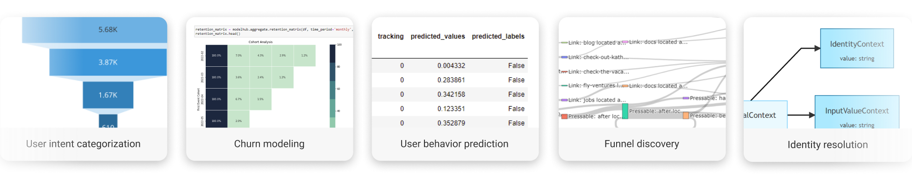

.. _example_notebooks:

.. frontmatterposition:: 5

=================
Example notebooks
=================

This section contains several example notebooks to demonstrate how you can use Objectiv to quickly 
build & run product analytics models and make the output actionable for the wider team.

The notebooks all use the :doc:`open model hub <,,/open_model_hub/index>`: a toolkit that contains pre-built product analytics models 
and functions that can be applied on data collected with `Objectiv's Tracker </docs/tracking/>`__. The open model hub is 
powered by :doc:`Bach <../bach/index>`, our Python-based modeling library with a pandas-like interface, that translates all 
operations to SQL under the hood.

Check out the example notebooks
~~~~~~~~~~~~~~~~~~~~~~~~~~~~~~~

.. toctree::
    :maxdepth: 1

    product-analytics
    marketing-analytics
    funnel-discovery
    logistic-regression
    feature-importance
    user-intent
    explore-data
    open-taxonomy
    modelhub-basics
    feature-engineering
    machine-learning

.. info:: Try the notebooks with demo data
    If you want to play around with the notebooks yourself, `get Objectiv Up </docs/home/up>`__ - a pre-packaged, dockerized version of Objectiv 
    that you can run locally or host yourself in under 5 minutes. It comes with everything you need to test-drive Objectiv, 
    and can be used in production by simply replacing the demo app with your own app.
