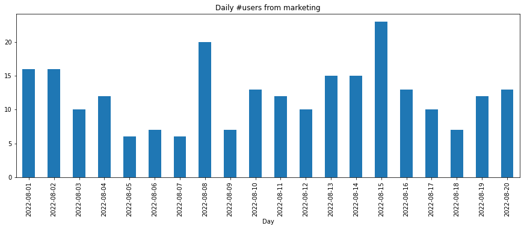
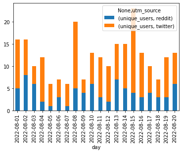
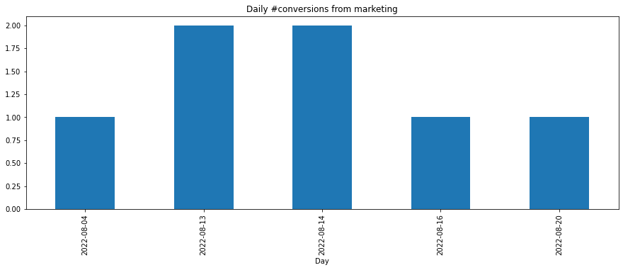
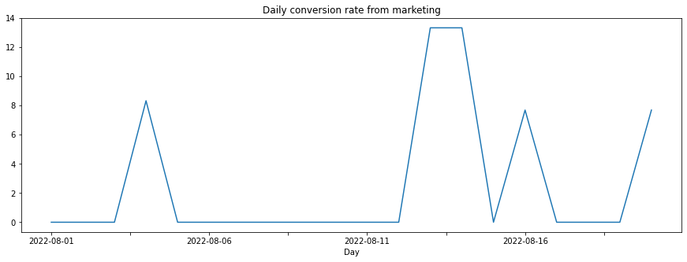
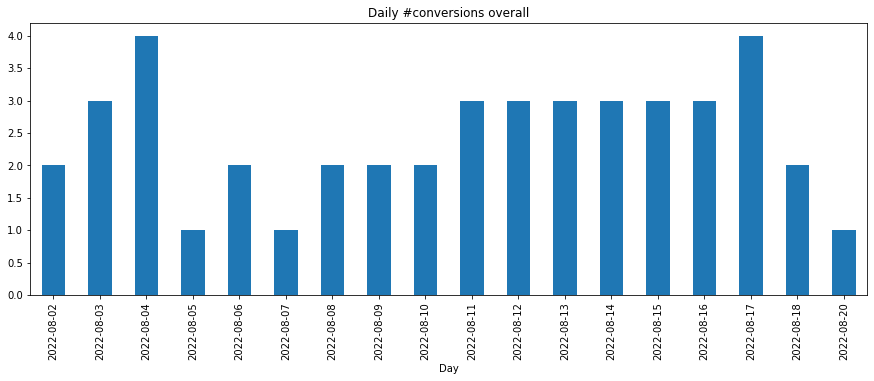
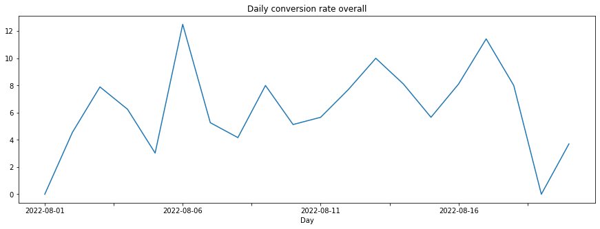
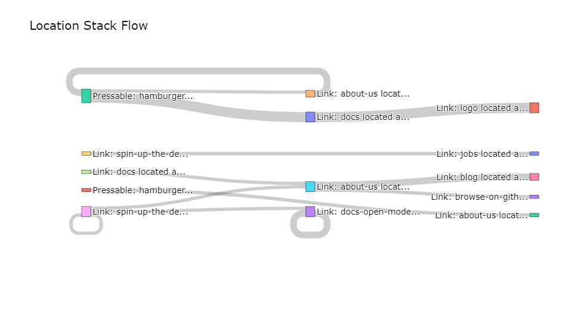

.. _marketing_analytics:

.. frontmatterposition:: 3

.. currentmodule:: bach_open_taxonomy

===================
Marketing analytics
===================

This example notebook shows how you can easily analyze traffic coming from Marketing campaigns, as measured 
via UTM tags. It's also available as a `full Jupyter notebook 
<https://github.com/objectiv/objectiv-analytics/blob/main/notebooks/marketing-analytics.ipynb>`_
to run on your own data (see how to :doc:`get started in your notebook <../get-started-in-your-notebook>`), 
or you can instead `run Objectiv Up </docs/home/up/>`__ to try it out. The dataset used here is the same as in 
Up.

Get started
-----------
We first have to instantiate the model hub and an Objectiv DataFrame object.

.. doctest::
	:skipif: engine is None

	>>> # set the timeframe of the analysis
	>>> start_date = '2022-08-01'
	>>> end_date = None

.. we override the timeframe for the doctests below
	
.. testsetup:: marketing-analytics
	:skipif: engine is None

	start_date = '2022-08-01'
	end_date = '2022-08-20'
	pd.set_option('display.max_colwidth', 93)

.. doctest:: marketing-analytics
	:skipif: engine is None

	>>> # instantiate the model hub, and set the default time aggregation to daily
	>>> # and set the global contexts that will be used in this example
	>>> from modelhub import ModelHub, display_sql_as_markdown
	>>> from bach import DataFrame
	>>> from sql_models.util import is_bigquery
	>>> import pandas as pd
	>>> modelhub = ModelHub(time_aggregation='%Y-%m-%d', global_contexts=['http', 'marketing', 'application'])
	>>> # get an Objectiv DataFrame within a defined timeframe
	>>> df = modelhub.get_objectiv_dataframe(db_url=DB_URL, start_date=start_date, end_date=end_date)

The `location_stack` column, and the columns taken from the global contexts, contain most of the 
event-specific data. These columns are JSON typed, and we can extract data from it using the keys of the JSON 
objects with :doc:`SeriesLocationStack 
<../open-model-hub/api-reference/SeriesLocationStack/modelhub.SeriesLocationStack>` methods, or the `context` 
accessor for global context columns. See the :doc:`open taxonomy example <./open-taxonomy>` for how to use 
the `location_stack` and global contexts.

.. doctest:: marketing-analytics
	:skipif: engine is None

	>>> # add `feature_nice_name` and `root_location` as columns, so that we can use it for grouping etc. later
	>>> df['feature_nice_name'] = df.location_stack.ls.nice_name
	>>> df['root_location'] = df.location_stack.ls.get_from_context_with_type_series(type='RootLocationContext', key='id')

.. doctest:: marketing-analytics
	:skipif: engine is None

	>>> # derive a specific DataFrame with added marketing contexts
	>>> df_acquisition = df.copy()
	>>> # extract referrer and marketing contexts from the respective global contexts
	>>> df_acquisition['referrer'] = df_acquisition.http.context.referrer
	>>> df_acquisition['utm_source'] = df_acquisition.marketing.context.source
	>>> df_acquisition['utm_medium'] = df_acquisition.marketing.context.medium
	>>> df_acquisition['utm_campaign'] = df_acquisition.marketing.context.campaign

.. doctest:: marketing-analytics
	:skipif: engine is None

	>>> # also define a DataFrame with only the sessions that came in via a marketing campaign
	>>> campaign_sessions = df_acquisition[~df_acquisition['utm_source'].isnull()]['session_id'].unique()
	>>> df_marketing_only = df_acquisition[df_acquisition['session_id'].isin(campaign_sessions)]

.. doctest:: marketing-analytics
	:skipif: engine is None

	>>> # define a further selection: which source to select in the below analyses.
	>>> source_selection = ['twitter', 'reddit']
	>>> sources = DataFrame.from_pandas(engine=df.engine, df=pd.DataFrame({'sources': source_selection})).sources
	>>> # filter on defined list of UTM Sources
	>>> df_marketing_selection = df_marketing_only[(df_marketing_only.utm_source.isin(sources))]

.. doctest:: marketing-analytics
	:skipif: engine is None

	>>> # for BigQuery materialize the DataFrame as temporary tables to reduce the complexity of the underlying queries
	>>> if is_bigquery(df.engine):
	...     df_acquisition = df_acquisition.materialize(materialization='temp_table')
	...     df_marketing_only = df_marketing_only.materialize(materialization='temp_table')
	...     df_marketing_selection = df_marketing_selection.materialize(materialization='temp_table')

**Available dataframes:**

- `df` = all + `feature_nice_name` + `root_location`.
- `df_acquisition` = `df` + referrer + UTMs
- `df_marketing_only` = `df_acquisition`, but only sessions with non_null `utm_source`.
- `df_marketing_selection` = `df_marketing_only`, but filtered for selection, e.g. only `utm_source` in `{'reddit', 'twitter'}`.

.. admonition:: Reference
	:class: api-reference

	* :doc:`modelhub.ModelHub <../open-model-hub/api-reference/ModelHub/modelhub.ModelHub>`
	* :doc:`modelhub.ModelHub.get_objectiv_dataframe <../open-model-hub/api-reference/ModelHub/modelhub.ModelHub.get_objectiv_dataframe>`
	* :ref:`using global context data <location-stack-and-global-contexts>`
	* :doc:`modelhub.SeriesLocationStack.ls <../open-model-hub/api-reference/SeriesLocationStack/modelhub.SeriesLocationStack.ls>`
	* :doc:`bach.DataFrame.from_pandas <../bach/api-reference/DataFrame/bach.DataFrame.from_pandas>`
	* :doc:`bach.Series.isnull <../bach/api-reference/Series/bach.Series.isnull>`
	* :doc:`bach.DataFrame.materialize <../bach/api-reference/DataFrame/bach.DataFrame.materialize>`

Acquisition
-----------

Users from marketing
~~~~~~~~~~~~~~~~~~~~

.. doctest:: marketing-analytics
	:skipif: engine is None

	>>> users_from_marketing_daily = modelhub.aggregate.unique_users(df_marketing_selection).sort_index(ascending=False)
	>>> users_from_marketing_daily_pdf = users_from_marketing_daily.to_pandas()
	>>> users_from_marketing_daily_pdf.head()
	time_aggregation
	2022-08-20    13
	2022-08-19    12
	2022-08-18     7
	2022-08-17    10
	2022-08-16    13
	Name: unique_users, dtype: int64

.. doctest:: marketing-analytics
	:skipif: engine is None
	:options: +ELLIPSIS

	>>> users_from_marketing_daily_pdf.sort_index(ascending=True).plot(kind='bar', figsize=[15,5], title='Daily #users from marketing', xlabel='Day')
	<AxesSubplot: title={'center': 'Daily #users from marketing'}, xlabel='Day'...>

Users from marketing _source_ per day
~~~~~~~~~~~~~~~~~~~~~~~~~~~~~~~~~~~~~

.. doctest:: marketing-analytics
	:skipif: engine is None

	>>> # users by marketing _source_, per day
	>>> source_users_daily = modelhub.agg.unique_users(df_marketing_selection, groupby=['day', 'utm_source'])
	>>> source_users_daily = source_users_daily.reset_index().sort_values('day', ascending=False)
	>>> source_users_daily_pdf = source_users_daily.to_pandas()
	>>> source_users_daily_pdf.head(20)
	           day utm_source  unique_users
	0   2022-08-20    twitter             7
	1   2022-08-20     reddit             6
	2   2022-08-19    twitter             9
	3   2022-08-19     reddit             3
	4   2022-08-18     reddit             3
	5   2022-08-18    twitter             4
	6   2022-08-17    twitter             6
	7   2022-08-17     reddit             4
	8   2022-08-16    twitter            10
	9   2022-08-16     reddit             3
	10  2022-08-15    twitter            19
	11  2022-08-15     reddit             4
	12  2022-08-14    twitter            10
	13  2022-08-14     reddit             5
	14  2022-08-13    twitter             8
	15  2022-08-13     reddit             7
	16  2022-08-12    twitter             8
	17  2022-08-12     reddit             2
	18  2022-08-11     reddit             3
	19  2022-08-11    twitter             9

.. doctest:: marketing-analytics
	:skipif: engine is None

	>>> sud = source_users_daily_pdf.pivot(index='day', columns='utm_source')
	>>> sud.plot.bar(stacked=True)
	<AxesSubplot: xlabel='day'>

Users from marketing _campaign_ per day
~~~~~~~~~~~~~~~~~~~~~~~~~~~~~~~~~~~~~~~

.. doctest:: marketing-analytics
	:skipif: engine is None

	>>> # users by marketing _campaign_ (based on UTM data), per day
	>>> users_per_campaign_daily = modelhub.aggregate.unique_users(df_marketing_selection, ['day', 'utm_source', 'utm_medium', 'utm_campaign'])
	>>> users_per_campaign_daily.reset_index().sort_values('day', ascending=False).head(20)
	           day utm_source utm_medium     utm_campaign  unique_users
	0   2022-08-20     reddit       paid  july_conversion             6
	1   2022-08-20    twitter       paid  july_conversion             7
	2   2022-08-19     reddit       paid  july_conversion             3
	3   2022-08-19    twitter       paid  july_conversion             9
	4   2022-08-18    twitter     social             blog             1
	5   2022-08-18    twitter       paid  july_conversion             3
	6   2022-08-18     reddit       paid  july_conversion             3
	7   2022-08-17    twitter       paid  july_conversion             6
	8   2022-08-17     reddit       paid  july_conversion             4
	9   2022-08-16    twitter       paid  july_conversion            10
	10  2022-08-16     reddit       paid  july_conversion             3
	11  2022-08-15    twitter       paid  july_conversion            19
	12  2022-08-15     reddit       paid  july_conversion             4
	13  2022-08-14     reddit       paid  july_conversion             5
	14  2022-08-14    twitter       paid  july_conversion            10
	15  2022-08-13    twitter       paid  july_conversion             8
	16  2022-08-13     reddit       paid  july_conversion             7
	17  2022-08-12     reddit       paid  july_conversion             2
	18  2022-08-12    twitter       paid  july_conversion             8
	19  2022-08-11     reddit       paid  july_conversion             3

Referrers overall
~~~~~~~~~~~~~~~~~

.. doctest:: marketing-analytics
	:skipif: engine is None

	>>> # users by referrer in full timeframe (overall, including coming from marketing campaigns)
	>>> referrer_users = modelhub.agg.unique_users(df_acquisition, groupby=['referrer']).sort_values(ascending=False)
	>>> referrer_users.head(20)
	referrer
	                                                           392
	https://www.reddit.com/                                     82
	https://www.google.com/                                     80
	https://t.co/                                               27
	https://github.com/objectiv/objectiv-analytics              21
	https://www.linkedin.com/                                   19
	https://www.kdnuggets.com/                                  14
	https://github.com/RunaCapital/awesome-oss-alternatives     12
	https://github.com/                                          9
	https://www.fly.vc/                                          6
	https://bohr.atomico.com/                                    4
	https://objectiv.io/docs/modeling/                           4
	https://news.ycombinator.com/                                4
	https://stackshare.io/                                       3
	android-app://com.linkedin.android/                          3
	https://snowplowanalytics.com/                               3
	https://okt.to/                                              3
	https://www.google.nl/                                       3
	android-app://com.slack/                                     2
	https://objectiv.io/docs/home/quickstart-guide/              2
	Name: unique_users, dtype: int64

.. admonition:: Reference
	:class: api-reference

	* :doc:`bach.Series.sort_index <../bach/api-reference/Series/bach.Series.sort_index>`
	* :doc:`bach.Series.to_pandas <../bach/api-reference/Series/bach.Series.to_pandas>`
	* :doc:`modelhub.Aggregate.unique_users <../open-model-hub/models/aggregation/modelhub.Aggregate.unique_users>`
	* :doc:`bach.Series.reset_index <../bach/api-reference/Series/bach.Series.reset_index>`
	* :doc:`bach.Series.group_by <../bach/api-reference/Series/bach.Series.group_by>`
	* :doc:`bach.DataFrame.dropna <../bach/api-reference/DataFrame/bach.DataFrame.dropna>`
	* :doc:`bach.DataFrame.to_pandas <../bach/api-reference/DataFrame/bach.DataFrame.to_pandas>`
	* :doc:`bach.Series.to_frame <../bach/api-reference/Series/bach.Series.to_frame>`
	* :doc:`bach.DataFrame.head <../bach/api-reference/DataFrame/bach.DataFrame.head>`

Conversion
----------
See conversion overall and from marketing. Conversion in this example is defined as clicking any link on the 
website or docs to our GitHub repo.

.. doctest:: marketing-analytics
	:skipif: engine is None

	>>> # define the conversion event in `df_acquisition` and `df_marketing_selection`
	>>> # in this example: clicking any link leading to our GitHub repo
	>>> # create a column that extracts all location stacks that lead to our GitHub repo
	>>> df_acquisition['ls_conversion'] = df_acquisition[(df_acquisition.location_stack.ls[:{'_type':'LinkContext', 'id':'browse-on-github'}] != []) | (df_acquisition.location_stack.ls[:{'_type':'LinkContext', 'id':'github-stars-button'}] != []) | (df_acquisition.location_stack.ls[:{'_type':'LinkContext', 'id':'github'}] != [])].location_stack
	>>> modelhub.add_conversion_event(location_stack=df_acquisition['ls_conversion'], event_type='PressEvent', name='github_press')
	>>> df_marketing_selection['ls_conversion'] = df_marketing_selection[(df_marketing_selection.location_stack.ls[:{'_type':'LinkContext', 'id':'browse-on-github'}] != []) | (df_marketing_selection.location_stack.ls[:{'_type':'LinkContext', 'id':'github-stars-button'}] != []) | (df_marketing_selection.location_stack.ls[:{'_type':'LinkContext', 'id':'github'}] != [])].location_stack
	>>> modelhub.add_conversion_event(location_stack=df_marketing_selection['ls_conversion'], event_type='PressEvent', name='github_press_marketing')
	>>> df_acquisition['is_conversion_event'] = modelhub.map.is_conversion_event(df_acquisition, 'github_press')
	>>> df_marketing_selection['is_conversion_event'] = modelhub.map.is_conversion_event(df_marketing_selection, 'github_press_marketing')

.. admonition:: Reference
	:class: api-reference

	* :doc:`bach.series.series_json.JsonAccessor <../bach/api-reference/Series/Json/bach.SeriesJson.json>`
	* :doc:`modelhub.ModelHub.add_conversion_event <../open-model-hub/api-reference/ModelHub/modelhub.ModelHub.add_conversion_event>`
	* :doc:`modelhub.Map.is_conversion_event <../open-model-hub/models/helper-functions/modelhub.Map.is_conversion_event>`	

Daily conversions from marketing
~~~~~~~~~~~~~~~~~~~~~~~~~~~~~~~~

.. doctest:: marketing-analytics
	:skipif: engine is None

	>>> # calculate daily conversions from marketing (based on UTM data)
	>>> conversions_from_marketing = df_marketing_selection[df_marketing_selection.is_conversion_event].dropna(axis=0, how='any', subset='utm_source')
	>>> conversions_from_marketing_daily = modelhub.aggregate.unique_users(conversions_from_marketing).sort_index(ascending=False)
	>>> conversions_from_marketing_daily_pdf = conversions_from_marketing_daily.to_pandas()
	>>> conversions_from_marketing_daily_pdf.head()
	time_aggregation
	2022-08-20    1
	2022-08-16    1
	2022-08-14    2
	2022-08-13    2
	2022-08-04    1
	Name: unique_users, dtype: int64

.. doctest:: marketing-analytics
	:skipif: engine is None

	>>> conversions_from_marketing_daily_pdf.sort_index(ascending=True).plot(kind='bar', figsize=[15,5], title='Daily #conversions from marketing', xlabel='Day')
	<AxesSubplot: title={'center': 'Daily #conversions from marketing'}, xlabel='Day'>

Daily conversion rate from marketing
~~~~~~~~~~~~~~~~~~~~~~~~~~~~~~~~~~~~

.. doctest:: marketing-analytics
	:skipif: engine is None

	>>> # calculate daily conversion rate from marketing campaigns overall
	>>> # divide conversions from campaigns by total daily number of people coming from campaigns 
	>>> conversion_rate_from_marketing = ((conversions_from_marketing_daily / users_from_marketing_daily) * 100).fillna(0.0)
	>>> conversion_rate_from_marketing_pdf = conversion_rate_from_marketing.sort_index(ascending=False).to_pandas()
	>>> conversion_rate_from_marketing_pdf.head(10)
	time_aggregation
	2022-08-20     7.692308
	2022-08-19     0.000000
	2022-08-18     0.000000
	2022-08-17     0.000000
	2022-08-16     7.692308
	2022-08-15     0.000000
	2022-08-14    13.333333
	2022-08-13    13.333333
	2022-08-12     0.000000
	2022-08-11     0.000000
	Name: unique_users, dtype: float64

.. doctest:: marketing-analytics
	:skipif: engine is None

	>>> conversion_rate_from_marketing_pdf.sort_index(ascending=True).plot(kind='line', figsize=[15,5], title='Daily conversion rate from marketing', xlabel='Day')
	<AxesSubplot: title={'center': 'Daily conversion rate from marketing'}, xlabel='Day'>

.. doctest:: marketing-analytics
	:skipif: engine is None

	>>> # combined DataFrame with #conversions + conversion rate, daily
	>>> conversions_from_marketing_plus_rate = conversions_from_marketing_daily.to_frame().merge(conversion_rate_from_marketing.to_frame(), on='time_aggregation', how='left').sort_index(ascending=False)
	>>> conversions_from_marketing_plus_rate = conversions_from_marketing_plus_rate.rename(columns={'unique_users_x': 'converted_users', 'unique_users_y': 'conversion_rate'})
	>>> conversions_from_marketing_plus_rate.head()
	                  converted_users  conversion_rate
	time_aggregation
	2022-08-20                      1         7.692308
	2022-08-16                      1         7.692308
	2022-08-14                      2        13.333333
	2022-08-13                      2        13.333333
	2022-08-04                      1         8.333333

Daily conversions overall
~~~~~~~~~~~~~~~~~~~~~~~~~

.. doctest:: marketing-analytics
	:skipif: engine is None

	>>> # calculate daily conversions overall (including from marketing campaigns)
	>>> conversions_overall = modelhub.aggregate.unique_users(df_acquisition[df_acquisition.is_conversion_event])
	>>> conversions_overall_pdf = conversions_overall.sort_index(ascending=False).to_pandas()
	>>> conversions_overall_pdf.head()
	time_aggregation
	2022-08-20    1
	2022-08-18    2
	2022-08-17    4
	2022-08-16    3
	2022-08-15    3
	Name: unique_users, dtype: int64

	>>> # plot daily conversions overall (including from marketing campaigns)
	>>> conversions_overall_pdf.sort_index(ascending=True).plot(kind='bar', figsize=[15,5], title='Daily #conversions overall', xlabel='Day')
	<AxesSubplot: title={'center': 'Daily #conversions overall'}, xlabel='Day'>

Daily conversion rate overall
~~~~~~~~~~~~~~~~~~~~~~~~~~~~~

.. doctest:: marketing-analytics
	:skipif: engine is None

	>>> # calculate daily conversion rate overall (including from marketing campaigns)
	>>> daily_users = modelhub.aggregate.unique_users(df_acquisition).sort_index(ascending=False)
	>>> conversion_rate_overall = (conversions_overall / daily_users) * 100
	>>> conversion_rate_overall_pdf = conversion_rate_overall.sort_index(ascending=False).fillna(0.0).to_pandas()
	>>> conversion_rate_overall_pdf.head(10)
	time_aggregation
	2022-08-20     3.703704
	2022-08-19     0.000000
	2022-08-18     8.000000
	2022-08-17    11.428571
	2022-08-16     8.108108
	2022-08-15     5.660377
	2022-08-14     8.108108
	2022-08-13    10.000000
	2022-08-12     7.692308
	2022-08-11     5.660377
	Name: unique_users, dtype: float64

	>>> conversion_rate_overall_pdf.sort_index(ascending=True).plot(kind='line', figsize=[15,5], title='Daily conversion rate overall', xlabel='Day')
	<AxesSubplot: title={'center': 'Daily conversion rate overall'}, xlabel='Day'>

.. admonition:: Reference
	:class: api-reference

	* :doc:`modelhub.Map.is_conversion_event <../open-model-hub/models/helper-functions/modelhub.Map.is_conversion_event>`
	* :doc:`bach.DataFrame.dropna <../bach/api-reference/DataFrame/bach.DataFrame.dropna>`
	* :doc:`modelhub.Aggregate.unique_users <../open-model-hub/models/aggregation/modelhub.Aggregate.unique_users>`
	* :doc:`bach.Series.sort_index <../bach/api-reference/Series/bach.Series.sort_index>`
	* :doc:`bach.DataFrame.to_pandas <../bach/api-reference/DataFrame/bach.DataFrame.to_pandas>`
	* :doc:`bach.DataFrame.fillna <../bach/api-reference/DataFrame/bach.DataFrame.fillna>`
	* :doc:`bach.DataFrame.head <../bach/api-reference/DataFrame/bach.DataFrame.head>`

Conversion split by source & campaign
~~~~~~~~~~~~~~~~~~~~~~~~~~~~~~~~~~~~~

Conversions per marketing _source_ daily
^^^^^^^^^^^^^^^^^^^^^^^^^^^^^^^^^^^^^^^^

.. doctest:: marketing-analytics
	:skipif: engine is None
	
	>>> # split daily conversions by marketing _source_ (based on UTM data)
	>>> campaign_conversions_source_daily = modelhub.aggregate.unique_users(df_marketing_selection[df_marketing_selection.is_conversion_event], ['day', 'utm_source'])
	>>> campaign_conversions_source_daily.reset_index().dropna(axis=0, how='any', subset='utm_source').set_index('day').sort_index(ascending=False).head()
	           utm_source  unique_users
	day
	2022-08-20     reddit             1
	2022-08-16     reddit             1
	2022-08-14    twitter             2
	2022-08-13     reddit             2
	2022-08-04    twitter             1

Conversions per marketing _campaign_ daily
^^^^^^^^^^^^^^^^^^^^^^^^^^^^^^^^^^^^^^^^^^^^^^^^^^^^^^^^

.. doctest:: marketing-analytics
	:skipif: engine is None
	
	>>> # split daily conversions by marketing _campaign_ (based on UTM data)
	>>> campaign_conversions_campaign_daily = modelhub.aggregate.unique_users(df_marketing_selection[df_marketing_selection.is_conversion_event], ['day', 'utm_source', 'utm_campaign'])
	>>> campaign_conversions_campaign_daily.reset_index().dropna(axis=0, how='any', subset='utm_campaign').set_index('day').sort_index(ascending=False).head(10)
	           utm_source     utm_campaign  unique_users
	day
	2022-08-20     reddit  july_conversion             1
	2022-08-16     reddit  july_conversion             1
	2022-08-14    twitter  july_conversion             2
	2022-08-13     reddit  july_conversion             2
	2022-08-04    twitter  july_conversion             1

.. admonition:: Reference
	:class: api-reference

	* :doc:`modelhub.Aggregate.unique_users <../open-model-hub/models/aggregation/modelhub.Aggregate.unique_users>`
	* :doc:`modelhub.Map.is_conversion_event <../open-model-hub/models/helper-functions/modelhub.Map.is_conversion_event>`
	* :doc:`bach.DataFrame.dropna <../bach/api-reference/DataFrame/bach.DataFrame.dropna>`
	* :doc:`bach.DataFrame.sort_values <../bach/api-reference/DataFrame/bach.DataFrame.sort_values>`
	* :doc:`bach.Series.sort_index <../bach/api-reference/Series/bach.Series.sort_index>`
	* :doc:`bach.DataFrame.head <../bach/api-reference/DataFrame/bach.DataFrame.head>`

Duration
--------

Avg. duration per ad source
~~~~~~~~~~~~~~~~~~~~~~~~~~~

.. doctest:: marketing-analytics
	:skipif: engine is None
	
	>>> # avg duration for users that come from an ad campaign in the full timeframe
	>>> duration_per_source = modelhub.aggregate.session_duration(df_marketing_selection, groupby=['utm_source']).to_frame()
	>>> duration_per_source.sort_values(['utm_source'], ascending=False).head(10)
	                 session_duration
	utm_source
	twitter    0 days 00:01:31.449472
	reddit     0 days 00:01:04.909909

Vs. avg. duration by all users
~~~~~~~~~~~~~~~~~~~~~~~~~~~~~~

.. doctest:: marketing-analytics
	:skipif: engine is None
	
	>>> # vs time spent by all users
	>>> modelhub.aggregate.session_duration(df_acquisition, groupby=None).to_frame().head()
	        session_duration
	0 0 days 00:03:48.160022

Avg. duration _before first conversion_ per _source_
~~~~~~~~~~~~~~~~~~~~~~~~~~~~~~~~~~~~~~~~~~~~~~~~~~~~
Avg. duration per campaign _source_ for users who converted for the very first time (not including hits or 
sessions after the moment of conversion).

.. doctest:: marketing-analytics
	:skipif: engine is None

	>>> # avg duration before conversion - per source
	>>> # label sessions with a conversion
	>>> df_marketing_selection['converted_users'] = modelhub.map.conversions_counter(df_marketing_selection, name='github_press') >= 1
	>>> # label hits where at that point in time, there are 0 conversions in the session
	>>> df_marketing_selection['zero_conversions_at_moment'] = modelhub.map.conversions_in_time(df_marketing_selection, 'github_press') == 0
	>>> # filter on above created labels to find the users who converted for the very first time
	>>> converted_users = df_marketing_selection[(df_marketing_selection.converted_users & df_marketing_selection.zero_conversions_at_moment)]
	>>> modelhub.aggregate.session_duration(converted_users, groupby=['utm_source']).to_frame().head()
	                 session_duration
	utm_source
	reddit     0 days 00:00:17.502500
	twitter    0 days 00:01:44.533667

.. admonition:: Note
	
	To filter out bounces, use parameter `exclude_bounces=True` for the `session_duration` model.

.. admonition:: Reference
	:class: api-reference

	* :doc:`modelhub.Aggregate.session_duration <../open-model-hub/models/aggregation/modelhub.Aggregate.session_duration>`
	* :doc:`bach.Series.to_frame <../bach/api-reference/Series/bach.Series.to_frame>`
	* :doc:`bach.DataFrame.sort_values <../bach/api-reference/DataFrame/bach.DataFrame.sort_values>`
	* :doc:`modelhub.Map.conversions_counter <../open-model-hub/models/helper-functions/modelhub.Map.conversions_counter>`
	* :doc:`modelhub.Map.conversions_in_time <../open-model-hub/models/helper-functions/modelhub.Map.conversions_in_time>`
	* :doc:`bach.DataFrame.head <../bach/api-reference/DataFrame/bach.DataFrame.head>`

Duration & conversions
----------------------

.. doctest:: marketing-analytics
	:skipif: engine is None

	>>> # see daily duration & conversions per ad _source_
	>>> # first calculate time spent per campaign source, daily
	>>> duration_per_source_daily = modelhub.agg.session_duration(df_marketing_selection, groupby=['utm_source', 'day']).to_frame()
	>>> # calculate the number of users per campaign source, daily
	>>> source_users_daily = modelhub.agg.unique_users(df_acquisition, groupby=['utm_source', 'day'])
	>>> source_users_daily = source_users_daily.reset_index()
	>>> # add them together
	>>> source_duration_users_daily = duration_per_source_daily.merge(source_users_daily, how='left', on=['utm_source', 'day']);
	>>> # also add #conversions
	>>> converted_users = campaign_conversions_source_daily.to_frame().rename(columns={"unique_users": "converted_users"})
	>>> source_duration_users_daily = source_duration_users_daily.merge(converted_users, how='left', on=['utm_source', 'day'])
	>>> source_duration_users_daily = source_duration_users_daily.sort_values(['utm_source', 'day'], ascending=False)
	>>> source_duration_users_daily.head(20)
	                            session_duration  unique_users  converted_users
	utm_source day
	twitter    2022-08-20 0 days 00:02:54.795125             7              NaN
	           2022-08-19 0 days 00:08:50.363750             9              NaN
	           2022-08-18 0 days 00:00:13.853333             4              NaN
	           2022-08-17 0 days 00:00:17.638400             6              NaN
	           2022-08-16 0 days 00:01:22.959429            10              NaN
	           2022-08-15 0 days 00:00:41.717133            19              NaN
	           2022-08-14 0 days 00:01:23.530200            10              2.0
	           2022-08-13 0 days 00:01:08.181000             8              NaN
	           2022-08-12 0 days 00:00:08.564000             8              NaN
	           2022-08-11 0 days 00:00:15.621500             9              NaN
	           2022-08-10 0 days 00:00:23.947714             7              NaN
	           2022-08-08 0 days 00:03:13.881900            15              NaN
	           2022-08-07 0 days 00:00:16.193333             5              NaN
	           2022-08-05 0 days 00:00:01.339500             5              NaN
	           2022-08-04 0 days 00:01:03.227500            10              1.0
	           2022-08-03 0 days 00:05:55.457000             4              NaN
	           2022-08-02 0 days 00:00:09.290600             8              NaN
	           2022-08-01 0 days 00:00:39.053833            11              NaN
	reddit     2022-08-20 0 days 00:00:17.293333             6              1.0
	           2022-08-19 0 days 00:00:46.239000             3              NaN

.. admonition:: Reference
	:class: api-reference

	* :doc:`modelhub.Aggregate.session_duration <../open-model-hub/models/aggregation/modelhub.Aggregate.session_duration>`
	* :doc:`bach.Series.to_frame <../bach/api-reference/Series/bach.Series.to_frame>`
	* :doc:`modelhub.Aggregate.unique_users <../open-model-hub/models/aggregation/modelhub.Aggregate.unique_users>`
	* :doc:`bach.Series.reset_index <../bach/api-reference/Series/bach.Series.reset_index>`
	* :doc:`bach.DataFrame.merge <../bach/api-reference/DataFrame/bach.DataFrame.merge>`
	* :doc:`bach.DataFrame.rename <../bach/api-reference/DataFrame/bach.DataFrame.rename>`
	* :doc:`bach.DataFrame.sort_values <../bach/api-reference/DataFrame/bach.DataFrame.sort_values>`
	* :doc:`bach.DataFrame.head <../bach/api-reference/DataFrame/bach.DataFrame.head>`

Deep-dive into user behavior from marketing
-------------------------------------------

Top used product features for users from marketing campaigns
~~~~~~~~~~~~~~~~~~~~~~~~~~~~~~~~~~~~~~~~~~~~~~~~~~~~~~~~~~~~

.. doctest:: marketing-analytics
	:skipif: engine is None

	>>> # top used product features for users coming from marketing campaigns
	>>> top_product_features_from_marketing = modelhub.aggregate.top_product_features(df_marketing_selection)
	>>> top_product_features_from_marketing.head(20)
	                                                                                                                           user_id_nunique
	application      feature_nice_name                                                                             event_type
	objectiv-website Link: about-us located at Root Location: home => Navigation: navbar-top                       PressEvent               16
	                 Link: spin-up-the-demo located at Root Location: home => Content: hero                        PressEvent               11
	                 Link: docs located at Root Location: home => Navigation: navbar-top                           PressEvent                8
	                 Link: blog located at Root Location: home => Navigation: navbar-top                           PressEvent                5
	                 Link: browse-on-github located at Root Location: home => Content: hero                        PressEvent                4
	                 Link: jobs located at Root Location: home => Navigation: navbar-top                           PressEvent                4
	                 Link: spin-up-the-demo located at Root Location: home => Content: try-it                      PressEvent                4
	                 Link: github located at Root Location: home => Navigation: navbar-top                         PressEvent                3
	                 Link: logo located at Root Location: blog => Navigation: navbar-top                           PressEvent                3
	                 Link: docs-open-model-hub located at Root Location: home => Content: solution                 PressEvent                2
	                 Link: logo located at Root Location: home => Navigation: navbar-top                           PressEvent                2
	                 Link: faq located at Root Location: home => Navigation: navbar-top                            PressEvent                2
	                 Pressable: hamburger located at Root Location: home => Navigation: navbar-top                 PressEvent                1
	                 Link: about-us located at Root Location: home => Navigation: navbar-top => Overlay: hambur... PressEvent                1
	                 Link: docs located at Root Location: blog => Navigation: navbar-top => Overlay: hamburger-... PressEvent                1
	                 Link: docs-modeling located at Root Location: home => Content: solution                       PressEvent                1
	                 Link: docs-taxonomy located at Root Location: home => Content: solution                       PressEvent                1
	                 Link: docs-taxonomy located at Root Location: home => Content: taxonomy                       PressEvent                1
	                 Link: open-model-hub located at Root Location: home => Content: data-modeling                 PressEvent                1
	                 Link: privacy-policy located at Root Location: home => Navigation: footer                     PressEvent                1

Top used product features for users from marketing campaigns, before they convert
^^^^^^^^^^^^^^^^^^^^^^^^^^^^^^^^^^^^^^^^^^^^^^^^^^^^^^^^^^^^^^^^^^^^^^^^^^^^^^^^^

.. doctest:: marketing-analytics
	:skipif: engine is None

	>>> # top used product features for users coming from marketing campaigns, before they convert
	>>> if is_bigquery(df.engine):
	...     df_marketing_selection = df_marketing_selection.materialize(materialization='temp_table')
	>>> top_features_before_conversion_from_marketing = modelhub.agg.top_product_features_before_conversion(df_marketing_selection, name='github_press')
	>>> top_features_before_conversion_from_marketing.head(20)
	                                                                                                     unique_users
	application      feature_nice_name                                                       event_type
	objectiv-website Link: about-us located at Root Location: home => Navigation: navbar-top PressEvent  1

.. admonition:: Reference
	:class: api-reference

	* :doc:`modelhub.Aggregate.top_product_features <../open-model-hub/models/aggregation/modelhub.Aggregate.top_product_features>`
	* :doc:`modelhub.Aggregate.top_product_features_before_conversion <../open-model-hub/models/aggregation/modelhub.Aggregate.top_product_features_before_conversion>`
	* :doc:`bach.DataFrame.head <../bach/api-reference/DataFrame/bach.DataFrame.head>`

Funnel Discovery: flows for _all_ users from marketing campaigns
~~~~~~~~~~~~~~~~~~~~~~~~~~~~~~~~~~~~~~~~~~~~~~~~~~~~~~~~~~~~~~~~

.. doctest:: marketing-analytics
	:skipif: engine is None

	>>> # select which event type to use for further analysis - PressEvents to focus on what users directly interact with
	>>> df_funnel_from_marketing = df_marketing_selection[df_marketing_selection['event_type'] == 'PressEvent']
	>>> # instantiate the FunnelDiscovery model from the open model hub
	>>> funnel = modelhub.get_funnel_discovery()
	>>> # set the maximum n steps
	>>> max_steps = 4

.. doctest:: marketing-analytics
	:skipif: engine is None

	>>> # for every user starting their session, find all maximum n consecutive steps they took
	>>> df_steps = funnel.get_navigation_paths(df_funnel_from_marketing, steps=max_steps, by='user_id')
	>>> df_steps.head()
	                                                                                        location_stack_step_1                                                    location_stack_step_2 location_stack_step_3 location_stack_step_4
	user_id
	00d9abb7-8f5b-40ef-b189-4b046450eb3d  Link: about-us located at Root Location: home => Navigation: navbar-top                                                                     None                  None                  None
	06186850-48e2-49b1-963f-8615eab56f30  Link: about-us located at Root Location: home => Navigation: navbar-top                                                                     None                  None                  None
	10a4beb9-a55b-4d30-8975-2c3c23015c1d      Link: docs located at Root Location: home => Navigation: navbar-top  Link: about-us located at Root Location: home => Navigation: navbar-top                  None                  None
	11311189-2e02-458d-b474-9137b7d9d8f3       Link: faq located at Root Location: home => Navigation: navbar-top                                                                     None                  None                  None
	132ef6df-8f7f-42a6-9a33-b63f3f408309   Link: spin-up-the-demo located at Root Location: home => Content: hero                                                                     None                  None                  None

.. code-block:: jupyter-notebook
	
	>>> funnel.plot_sankey_diagram(df_steps, n_top_examples=50)

Funnel Discovery: flows for _converted_ users from marketing
~~~~~~~~~~~~~~~~~~~~~~~~~~~~~~~~~~~~~~~~~~~~~~~~~~~~~~~~~~~~

.. doctest:: marketing-analytics
	:skipif: engine is None

	>>> # add which step resulted in conversion to the dataframe, with the `add_conversion_step_column` param
	>>> # filter down to all sequences that have actually converted with the `only_converted_paths` param
	>>> df_steps_till_conversion = funnel.get_navigation_paths(df_funnel_from_marketing, steps=max_steps, by='user_id', add_conversion_step_column=True, only_converted_paths=True)
	>>> df_steps_till_conversion.head(5)
	                                                                                        location_stack_step_1                                                   location_stack_step_2 location_stack_step_3 location_stack_step_4  _first_conversion_step_number
	user_id
	99f741a0-d05e-4688-8bd9-53f66bf926aa  Link: about-us located at Root Location: home => Navigation: navbar-top  Link: browse-on-github located at Root Location: home => Content: hero                  None                  None                              2

.. code-block:: jupyter-notebook
	
	>>> # plot the Sankey diagram using the top examples via the `n_top_examples` param
	>>> condition_convert_on_step = df_steps_till_conversion['_first_conversion_step_number'] == 2
	>>> funnel.plot_sankey_diagram(df_steps_till_conversion[condition_convert_on_step], n_top_examples=15)

.. image:: ../img/docs/example-notebooks/marketing-analytics-funnel-converted.png
  :alt: Funnel Discovery: flows for converted users from marketing campaigns

Funnel Discovery: drop-off for users from marketing
~~~~~~~~~~~~~~~~~~~~~~~~~~~~~~~~~~~~~~~~~~~~~~~~~~~

.. doctest:: marketing-analytics
	:skipif: engine is None

	>>> # select only non-converted users
	>>> df_funnel_non_converted = df_marketing_selection[~df_marketing_selection['is_conversion_event']]
	>>> funnel_converted_users = df_marketing_selection[df_marketing_selection['is_conversion_event']]['user_id']
	>>> # select the events of these non converted users
	>>> df_funnel_non_converted = df_funnel_non_converted[~df_funnel_non_converted['user_id'].isin(funnel_converted_users)]
	>>> # get the last used feature in the location_stack before dropping off
	>>> modelhub.aggregate.drop_off_locations(df_funnel_non_converted, groupby='user_id', percentage=True).head(10)
	                                                                                               percentage
	location
	Root Location: home                                                                             50.691244
	Overlay: star-us-notification-overlay located at Root Location: home => Pressable: star-us...   46.543779
	Root Location: blog                                                                              1.843318
	Content: post-release-objectiv-now-has-support-for-deepnote located at Root Location: blog       0.921659

.. admonition:: Reference
	:class: api-reference

	* :doc:`modelhub.ModelHub.get_funnel_discovery <../open-model-hub/api-reference/ModelHub/modelhub.ModelHub.get_funnel_discovery>`
	* :doc:`modelhub.FunnelDiscovery.get_navigation_paths <../open-model-hub/models/funnels/FunnelDiscovery/modelhub.FunnelDiscovery.get_navigation_paths>`
	* :doc:`bach.Series.to_frame <../bach/api-reference/Series/bach.Series.to_frame>`
	* :doc:`bach.DataFrame.head <../bach/api-reference/DataFrame/bach.DataFrame.head>`
	* :doc:`modelhub.FunnelDiscovery.plot_sankey_diagram <../open-model-hub/models/funnels/FunnelDiscovery/modelhub.FunnelDiscovery.plot_sankey_diagram>`
	* :doc:`bach.DataFrame.rename <../bach/api-reference/DataFrame/bach.DataFrame.rename>`
	* :doc:`bach.DataFrame.sort_values <../bach/api-reference/DataFrame/bach.DataFrame.sort_values>`

Predict User Behavior from campaigns
------------------------------------

You can run predictive modeling on your marketing data as well. For example, you can create a feature for the 
number of times a user came in through a specific marketing source.

The created marketing feature set can be merged with any user-level feature set for logistic regression, like 
`features_set_sample` from the :doc:`logistic regression example notebook <./logistic-regression>`. 
For more details on how to do feature engineering, see our 
:doc:`feature engineering example notebook <./feature-engineering>`.

.. doctest:: marketing-analytics
	:skipif: engine is None

	>>> # create a feature for the number of times a user came in through a specific marketing source:
	>>> feature_prepare = df_acquisition.copy()
	>>> feature_prepare['utm_source'] = feature_prepare.utm_source.fillna('none')
	>>> features_us = feature_prepare.groupby(['user_id', 'utm_source']).session_id.nunique()
	>>> features_us_unstacked = features_us.unstack(fill_value=0)
	>>> features_us_unstacked.head()
	                                      reddit  linkedin  twitter  none  reactdigest
	user_id
	00d9abb7-8f5b-40ef-b189-4b046450eb3d       0         0        1     1            0
	00f4ce36-a3dd-4830-a379-9d4d83340d34       0         0        1     0            0
	01db2734-458c-4381-9761-1fbb5804cdd3       0         0        1     0            0
	023ec189-91de-4458-9b46-6ac948b6d8b8       0         0        0     3            0
	028552a8-5951-435e-ab2b-e1278bfc7d41       0         0        0     1            0

.. admonition:: Reference
	:class: api-reference

	* :doc:`bach.DataFrame.copy <../bach/api-reference/DataFrame/bach.DataFrame.copy>`
	* :doc:`bach.DataFrame.fillna <../bach/api-reference/DataFrame/bach.DataFrame.fillna>`
	* :doc:`bach.DataFrame.groupby <../bach/api-reference/DataFrame/bach.DataFrame.groupby>`
	* :doc:`bach.DataFrame.nunique <../bach/api-reference/DataFrame/bach.DataFrame.nunique>`
	* :doc:`bach.Series.unstack <../bach/api-reference/Series/bach.Series.unstack>`
	* :doc:`bach.DataFrame.head <../bach/api-reference/DataFrame/bach.DataFrame.head>`

Get the SQL for any analysis
----------------------------

The SQL for any analysis can be exported with one command, so you can use models in production directly to 
simplify data debugging & delivery to BI tools like Metabase, dbt, etc. See how you can `quickly create BI 
dashboards with this <https://objectiv.io/docs/home/up#creating-bi-dashboards>`_.

.. exec_code::
	:language: jupyter-notebook
	:language_output: jupyter-notebook-out

	# --- hide: start ---
	import os
	import pandas as pd
	from bach import DataFrame
	from modelhub import ModelHub
	modelhub = ModelHub(time_aggregation='%Y-%m-%d', global_contexts=['http', 'marketing', 'application'])
	DB_URL = os.environ.get('OBJ_DB_PG_TEST_URL', 'postgresql://objectiv:@localhost:5432/objectiv')
	df = modelhub.get_objectiv_dataframe(db_url=DB_URL, start_date='2022-08-01', end_date='2022-08-20')
	df['feature_nice_name'] = df.location_stack.ls.nice_name
	df['root_location'] = df.location_stack.ls.get_from_context_with_type_series(type='RootLocationContext', key='id')
	df_acquisition = df.copy()
	df_acquisition['referrer'] = df_acquisition.http.context.referrer
	df_acquisition['utm_source'] = df_acquisition.marketing.context.source
	df_acquisition['utm_medium'] = df_acquisition.marketing.context.medium
	df_acquisition['utm_campaign'] = df_acquisition.marketing.context.campaign
	campaign_sessions = df_acquisition[~df_acquisition['utm_source'].isnull()]['session_id'].unique()
	df_marketing_only = df_acquisition[df_acquisition['session_id'].isin(campaign_sessions)]
	source_selection = ['twitter', 'reddit']
	sources = DataFrame.from_pandas(engine=df.engine, df=pd.DataFrame({'sources': source_selection})).sources
	df_marketing_selection = df_marketing_only[(df_marketing_only.utm_source.isin(sources))]
	df_marketing_selection = df_marketing_selection.materialize(materialization='temp_table')
	users_from_marketing_daily = modelhub.aggregate.unique_users(df_marketing_selection).sort_index(ascending=False)
	def display_sql_as_markdown(arg): [print('sql\n' + arg.view_sql() + '\n')]
	# --- hide: stop ---
	# show the underlying SQL for this dataframe - works for any dataframe/model in Objectiv
	display_sql_as_markdown(users_from_marketing_daily)

That's it! `Join us on Slack <https://objectiv.io/join-slack>`_ if you have any questions or suggestions.

Next Steps
----------

Play with this notebook in Objectiv Up
~~~~~~~~~~~~~~~~~~~~~~~~~~~~~~~~~~~~~~

Spin up a full-fledged product analytics pipeline with `Objectiv Up </docs/home/up>`__ in  under 5 minutes, 
and play with this example notebook yourself.

Use this notebook with your own data
~~~~~~~~~~~~~~~~~~~~~~~~~~~~~~~~~~~~

You can use the example notebooks on any dataset that was collected with Objectiv's tracker, so feel free to 
use them to bootstrap your own projects. They are available as Jupyter notebooks on our `GitHub repository 
<https://github.com/objectiv/objectiv-analytics/tree/main/notebooks>`_. See `instructions to set up the 
Objectiv tracker <https://objectiv.io/docs/tracking/>`_. 

Check out related example notebooks
~~~~~~~~~~~~~~~~~~~~~~~~~~~~~~~~~~~

* :doc:`Product Analytics notebook <./product-analytics>` - easily run basic product analytics on your data.
* :doc:`Funnel Discovery notebook <./funnel-discovery>` - analyze the paths that users take that impact your 
	product goals.
