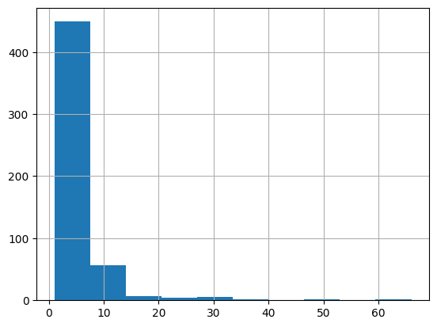

.. _example_modelhub_basics:

.. frontmatterposition:: 10

.. currentmodule:: bach

=====================
Open model hub basics
=====================

This example notebook shows how you can use the pre-built models from the :doc:`open model hub 
<../open-model-hub/index>` in conjunction with modeling library :doc:`Bach <../bach/index>` to 
quickly build model stacks to answer common analytics questions.

It's also available as a `full Jupyter notebook 
<https://github.com/objectiv/objectiv-analytics/blob/main/notebooks/model-hub-demo-notebook.ipynb>`_
to run on your own data (see how to :doc:`get started in your notebook <../get-started-in-your-notebook>`).
The dataset used here is the same as in `Objectiv Up </docs/home/up>`__.

Using the open model hub
------------------------
The following types of functions/models are provided:

1. :doc:`Helper functions <../open-model-hub/models/helper-functions/index>`: Simplify manipulating and 
    analyzing the data.
2. :doc:`Aggregation models <../open-model-hub/models/aggregation/index>`: Enable running some of the more common 
    data analyses and product analytics metrics.
3. :doc:`Machine learning models <../open-model-hub/models/machine-learning/index>`: ML models such as 
    logistic regression.
4. :doc:`Funnels <../open-model-hub/models/funnels/index>`: To analyze Funnels, e.g. discover all the (top) 
    user journeys that lead to conversion or drop-off.

Modeling behavior of users and groups is enabled through configurable 
:doc:`Identity Resolution <../open-model-hub/identity-resolution>`.

**Helper functions** always return a :doc:`Series <../bach/api-reference/Series/index>` with the same shape 
and index as the :doc:`DataFrame <../bach/api-reference/DataFrame/index>` they are applied to. This ensures 
they can be added as a column to that :doc:`DataFrame <../bach/api-reference/DataFrame/index>`. Helper 
functions that return :doc:`SeriesBoolean <../bach/api-reference/Series/Boolean/index>` can be used to filter 
the data. The helper functions can be accessed with the `map` accessor from a model hub instance.

**Aggregation models** perform multiple :doc:`Bach <../bach/index>` instructions that run some of the more 
common data analyses and product analytics metrics. They always return aggregated data in some form from the 
:doc:`DataFrame <../bach/api-reference/DataFrame/index>` they're applied to. Aggregation models can be 
accessed with the `aggregate` accessor from a model hub instance.

Most of the model hub helper functions and aggregation models take `data` as their first argument: this is
the :doc:`DataFrame <../bach/api-reference/DataFrame/index>` with the Objectiv data to apply the model to. 

For an example of a **machine learning model**, see the :doc:`logistic regression example notebook 
<../example-notebooks/logistic-regression>`.

Below we'll showcase a selection of the models from the open model hub.

Get started
-----------
We first have to instantiate the model hub and an Objectiv DataFrame object.

.. doctest:: modelhub
	:skipif: engine is None

	>>> # set the timeframe of the analysis
	>>> start_date = '2022-03-01'
	>>> end_date = None

.. we override the timeframe for the doctests below
	
.. doctest:: modelhub
	:hide:

	>>> start_date = '2022-03-01'
	>>> end_date = '2022-03-31'
	>>> pd.set_option('display.max_colwidth', 93)

.. doctest:: modelhub
	:skipif: engine is None

	>>> from modelhub import ModelHub, display_sql_as_markdown
	>>> from sql_models.util import is_bigquery
	>>> # instantiate the model hub and set the default time aggregation to daily
	>>> # and set the global contexts that will be used in this example
	>>> modelhub = ModelHub(time_aggregation='%Y-%m-%d', global_contexts=['application'])
	>>> # get a Bach DataFrame with Objectiv data within a defined timeframe
	>>> df = modelhub.get_objectiv_dataframe(start_date=start_date, end_date=end_date)

.. admonition:: Reference
	:class: api-reference

	* :doc:`modelhub.ModelHub <../open-model-hub/api-reference/ModelHub/modelhub.ModelHub>`
	* :doc:`modelhub.ModelHub.get_objectiv_dataframe <../open-model-hub/api-reference/ModelHub/modelhub.ModelHub.get_objectiv_dataframe>`

Run a simple aggregation model
------------------------------
Calculating the number of unique users is one of the models. As it is an aggregation model, it's called with 
:doc:`model_hub.aggregate.unique_users() 
<../open-model-hub/models/aggregation/modelhub.Aggregate.unique_users>` (or `model_hub.agg.unique_users()` for 
short). It uses the `time_aggregation` that is set when the model hub was instantiated. 

With :doc:`.head() <../bach/api-reference/DataFrame/bach.DataFrame.head>` we immediately query the data to 
show the results. :doc:`.to_pandas() <../bach/api-reference/DataFrame/bach.DataFrame.to_pandas>` can be used 
to use all results as a pandas object in Python. These (and the following) results are sorted descending, so 
we show the latest data first.

.. admonition:: Reference
	:class: api-reference

	* :doc:`model_hub.aggregate.unique_users() <../open-model-hub/models/aggregation/modelhub.Aggregate.unique_users>`
	* :doc:`bach.DataFrame.head() <../bach/api-reference/DataFrame/bach.DataFrame.head>`
	* :doc:`bach.DataFrame.to_pandas() <../bach/api-reference/DataFrame/bach.DataFrame.to_pandas>`

Mapping and filtering
---------------------
Here we'll use `map` operations from the open model hub to label certain users or events, in order to filter 
on them or combine them with other models later on.

First, we'll use `map` to label users as being a new user. As `time_aggregation` was set to '%Y-%m-%d' it 
means all hits are labeled as new for the entire day in which the user had its first session.

.. doctest:: modelhub
	:skipif: engine is None

	>>> # label new users & all their events on the defined time_aggregation 
	>>> df['is_new_user'] = modelhub.map.is_new_user(df)
	>>> df.is_new_user.head(10)
	event_id
	d4a0cb80-729c-4e17-9a42-6cb48672250f    True
	75afa7bc-5237-4033-a833-bf9e0e85a3c1    True
	0ae59c2c-2a2e-480c-8212-23d7aed2ae3c    True
	e2d95395-e7c1-4ab1-bf32-616bb485ff02    True
	75447a30-f379-4a8f-8568-77b9cb0b5039    True
	8e86f8e3-be55-4c5c-8a23-ba8dea38c35d    True
	854ec5e1-5c27-4c3b-b01c-98671eaa8da7    True
	adc6d6e1-9525-4e9c-9a02-1f79cd6428a6    True
	17aad036-4cca-4c31-a115-9601510907fc    True
	e139877e-ef37-426e-bc89-15e11d87effb    True
	Name: is_new_user, dtype: bool

We can also label conversion events. To do this, we first have to define what a conversion is, by setting the 
type of event and the location in the product where the event was triggered 
(:ref:`see more about the location stack here <location_stack>`), using :doc:`add_conversion_event 
<../open-model-hub/api-reference/ModelHub/modelhub.ModelHub.add_conversion_event>`.

.. doctest:: modelhub
	:skipif: engine is None

	>>> # define a conversion event, and label events whether they converted
	>>> modelhub.add_conversion_event(location_stack=df.location_stack.json[{'id': 'Quickstart Guide', '_type': 'LinkContext'}:], event_type='PressEvent', name='quickstart_presses')
	>>> df['conversion_events'] = modelhub.map.is_conversion_event(df, 'quickstart_presses')
	>>> df.conversion_events.head(10)
	event_id
	d4a0cb80-729c-4e17-9a42-6cb48672250f    False
	75afa7bc-5237-4033-a833-bf9e0e85a3c1    False
	0ae59c2c-2a2e-480c-8212-23d7aed2ae3c    False
	e2d95395-e7c1-4ab1-bf32-616bb485ff02    False
	75447a30-f379-4a8f-8568-77b9cb0b5039    False
	8e86f8e3-be55-4c5c-8a23-ba8dea38c35d    False
	854ec5e1-5c27-4c3b-b01c-98671eaa8da7    False
	adc6d6e1-9525-4e9c-9a02-1f79cd6428a6    False
	17aad036-4cca-4c31-a115-9601510907fc    False
	e139877e-ef37-426e-bc89-15e11d87effb    False
	Name: conversion_events, dtype: bool

Combine mapping with filtering and aggregattion
~~~~~~~~~~~~~~~~~~~~~~~~~~~~~~~~~~~~~~~~~~~~~~~

As the map functions above return a SeriesBoolean, they can be combined with filter and aggregation models. 
We use the same aggregation model we showed earlier (:doc:`unique_users 
<../open-model-hub/models/aggregation/modelhub.Aggregate.unique_users>`), but now applying the 
`df.conversion_events` filter to just look at unique converted users per day.

.. doctest:: modelhub
	:skipif: engine is None

	>>> # filter unique users on whether they've converted
	>>> modelhub.aggregate.unique_users(df[df.conversion_events]).sort_index(ascending=False).head(10)
	time_aggregation
	2022-03-31    1
	2022-03-28    1
	2022-03-26    1
	2022-03-24    1
	2022-03-22    3
	2022-03-21    4
	2022-03-17    1
	2022-03-15    1
	2022-03-13    1
	2022-03-09    2
	Name: unique_users, dtype: int64

Other aggregation models can be used similarly. In the example below, the average session duration is 
calculated just for new users.

.. doctest:: modelhub
	:skipif: engine is None

	>>> # calculate average session duration, filtered on new users
	>>> duration_new_users = modelhub.aggregate.session_duration(df[df.is_new_user])
	>>> duration_new_users.sort_index(ascending=False).head(10)
	time_aggregation
	2022-03-31   0 days 00:04:14.323667
	2022-03-30   0 days 00:00:23.893000
	2022-03-29   0 days 00:00:02.906500
	2022-03-28   0 days 00:03:01.878000
	2022-03-27   0 days 00:00:42.750600
	2022-03-26   0 days 00:01:34.580250
	2022-03-25   0 days 00:02:10.365571
	2022-03-24   0 days 00:00:42.824500
	2022-03-23   0 days 00:00:54.777167
	2022-03-22   0 days 00:01:02.964167
	Name: session_duration, dtype: timedelta64[ns]

Using multiple model hub filters
~~~~~~~~~~~~~~~~~~~~~~~~~~~~~~~~
The model hub's `map` results can be combined and reused. Below we set the result of two helper functions as 
a column to the original DataFrame, and use them both to filter the data and apply an aggregation model. We 
calculate the number of users that were new in a month, and also the number of users that converted twice on 
a day.

.. doctest:: modelhub
	:skipif: engine is None

	>>> # calculate new users & users that converted twice on a day
	>>> df['is_new_user_month'] = modelhub.map.is_new_user(df, time_aggregation = '%Y-%m')
	>>> df['is_twice_converted'] = modelhub.map.conversions_in_time(df, name='quickstart_presses')==2
	>>> # use results in an aggregation model
	>>> modelhub.aggregate.unique_users(df[df.is_new_user_month & df.is_twice_converted]).sort_index(ascending=False).head()
	time_aggregation
	2022-03-03    1
	Name: unique_users, dtype: int64

.. admonition:: Reference
	:class: api-reference

	* :doc:`modelhub.Map.is_new_user <../open-model-hub/models/helper-functions/modelhub.Map.is_new_user>`
	* :doc:`bach.DataFrame.head <../bach/api-reference/DataFrame/bach.DataFrame.head>`
	* :doc:`modelhub.ModelHub.add_conversion_event <../open-model-hub/api-reference/ModelHub/modelhub.ModelHub.add_conversion_event>`
	* :doc:`modelhub.Map.is_conversion_event <../open-model-hub/models/helper-functions/modelhub.Map.is_conversion_event>`
	* :doc:`modelhub.Aggregate.unique_users <../open-model-hub/models/aggregation/modelhub.Aggregate.unique_users>`
	* :doc:`modelhub.Aggregate.session_duration <../open-model-hub/models/aggregation/modelhub.Aggregate.session_duration>`
	* :doc:`modelhub.Map.conversions_in_time <../open-model-hub/models/helper-functions/modelhub.Map.conversions_in_time>`
	* :doc:`bach.DataFrame.sort_index <../bach/api-reference/DataFrame/bach.DataFrame.sort_index>`

Combine model results
---------------------
Results from aggregation models can be used together if they share the same index type - similar to pandas. 
Below the share of new users per day is calculated.

.. doctest:: modelhub
	:skipif: engine is None

	>>> # We'll do a lot of operations on the data in the df DataFrame. To make this easier for the
	>>> # BigQuery, we tell Bach to materialize the current DataFrame as temporary table.
	>>> # This statement has no direct effect, but any invocation of head() on the DataFrame later
	>>> # on will consist of two queries: one to create a temporary table with the current state of the
	>>> # DataFrame, and one that queries that table and does subsequent operations.
	>>> if is_bigquery(df.engine):
	...     df = df.materialize(materialization='temp_table')

.. doctest:: modelhub
	:skipif: engine is None

	>>> # calculate the share of new users per day using results from two aggregation models
	>>> new_user_share = modelhub.agg.unique_users(df[df.is_new_user]) / modelhub.agg.unique_users(df)
	>>> new_user_share.sort_index(ascending=False).head(10)
	time_aggregation
	2022-03-31    0.461538
	2022-03-30    0.800000
	2022-03-29    0.428571
	2022-03-28    0.454545
	2022-03-27    1.000000
	2022-03-26    0.857143
	2022-03-25    0.888889
	2022-03-24    0.833333
	2022-03-23    0.722222
	2022-03-22    0.611111
	Name: unique_users, dtype: float64

.. admonition:: Reference
	:class: api-reference

	* :doc:`modelhub.Aggregate.unique_users <../open-model-hub/models/aggregation/modelhub.Aggregate.unique_users>`
	* :doc:`modelhub.Map.is_new_user <../open-model-hub/models/helper-functions/modelhub.Map.is_new_user>`
	* :doc:`bach.DataFrame.sort_index <../bach/api-reference/DataFrame/bach.DataFrame.sort_index>`
	* :doc:`bach.DataFrame.head <../bach/api-reference/DataFrame/bach.DataFrame.head>`

Crunch data further with the Bach modeling library
--------------------------------------------------

All results from the model hub are in the form of a Bach :doc:`DataFrame 
<../bach/api-reference/DataFrame/index>` or :doc:`Series <../bach/api-reference/Series/index>`. This makes 
the open model hub and Bach work seamlessly together.

.. doctest:: modelhub
	:skipif: engine is None

	>>> # now label the number of times a user is converted in a session at a certain moment
	>>> df['conversion_count'] = modelhub.map.conversions_in_time(df, name='quickstart_presses')
	>>> 
	>>> # use Bach to do any supported operation using pandas syntax.
	>>> # select users that converted
	>>> converted_users = df[df.conversion_events].user_id.unique()
	>>> # select PressEvents of users that converted
	>>> df_selection = df[(df.event_type == 'PressEvent') & (df.user_id.isin(converted_users))]
	>>> # calculate the number of PressEvents before conversion per session
	>>> presses_per_session = df_selection[df_selection.conversion_count == 0].groupby('session_id').session_hit_number.count()
	>>> presses_per_session_pdf = presses_per_session.to_pandas()

Now let's see the results, at which point the underlying query is actually executed.

.. doctest:: modelhub
	:skipif: engine is None

	>>> presses_per_session_pdf.head()
	session_id
	6     2
	10    2
	11    1
	16    1
	23    2
	Name: session_hit_number, dtype: int64

See the :doc:`Bach API reference <../bach/api-reference/index>` for all available operations.

.. admonition:: Reference
	:class: api-reference

	* :doc:`bach.DataFrame.materialize <../bach/api-reference/DataFrame/bach.DataFrame.materialize>`
	* :doc:`modelhub.Map.conversions_in_time <../open-model-hub/models/helper-functions/modelhub.Map.conversions_in_time>`
	* :doc:`bach.Series.unique <../bach/api-reference/Series/bach.Series.unique>`
	* :doc:`bach.Series.isin <../bach/api-reference/Series/bach.Series.isin>`
	* :doc:`bach.DataFrame.groupby <../bach/api-reference/DataFrame/bach.DataFrame.groupby>`
	* :doc:`bach.DataFrame.head <../bach/api-reference/DataFrame/bach.DataFrame.head>`

Export results to a pandas DataFrame
------------------------------------

Bach DataFrames and/or model hub results can always be exported to pandas, so you can use all its options as 
well as pandas-compatible ML packages. Since Bach DataFrame operations run on the full dataset in the SQL data 
store, it is recommended to export to pandas if the data is small enough, i.e. by aggregation or selection.

Below we plot the previously calculated presses per session before conversion, using pandas' built-in 
plotting methods.

.. doctest:: modelhub
	:skipif: engine is None
	:options: +ELLIPSIS

	>>> presses_per_session_pdf.hist()
	<AxesSubplot:...>

.. admonition:: Reference
	:class: api-reference

	* :doc:`bach.DataFrame.to_pandas <../bach/api-reference/DataFrame/bach.DataFrame.to_pandas>`

Get the SQL for any analysis
----------------------------

The SQL for any analysis can be exported with one command, so you can use models in production directly to 
simplify data debugging & delivery to BI tools like Metabase, dbt, etc. See how you can `quickly create BI 
dashboards with this <https://objectiv.io/docs/home/up#creating-bi-dashboards>`_.

.. exec_code::
	:language: jupyter-notebook
	:language_output: jupyter-notebook-out

	# --- hide: start ---
	import os
	from modelhub import ModelHub
	modelhub = ModelHub(time_aggregation='%Y-%m-%d')
	DB_URL = os.environ.get('OBJ_DB_PG_TEST_URL', 'postgresql://objectiv:@localhost:5432/objectiv')
	df = modelhub.get_objectiv_dataframe(db_url=DB_URL, start_date='2022-03-01', end_date='2022-03-31')
	df['is_new_user'] = modelhub.map.is_new_user(df)
	modelhub.add_conversion_event(location_stack=df.location_stack.json[{'id': 'Quickstart Guide', '_type': 'LinkContext'}:], event_type='PressEvent', name='quickstart_presses')
	df['conversion_events'] = modelhub.map.is_conversion_event(df, 'quickstart_presses')
	df['is_new_user_month'] = modelhub.map.is_new_user(df, time_aggregation = '%Y-%m')
	df['is_twice_converted'] = modelhub.map.conversions_in_time(df, name='quickstart_presses')==2
	new_user_share = modelhub.agg.unique_users(df[df.is_new_user]) / modelhub.agg.unique_users(df)
	def display_sql_as_markdown(arg): [print('sql\n' + arg.view_sql() + '\n')]
	# --- hide: stop ---
	# show the underlying SQL for this dataframe - works for any dataframe/model in Objectiv
	display_sql_as_markdown(new_user_share)

That's it! `Join us on Slack <https://objectiv.io/join-slack>`_ if you have any questions or suggestions.

Next Steps
----------

Try the notebooks in Objectiv Up
~~~~~~~~~~~~~~~~~~~~~~~~~~~~~~~~

Spin up a full-fledged product analytics pipeline with `Objectiv Up </docs/home/up>`__ in under 5 minutes, 
and play with the included example notebooks yourself.

Use this notebook with your own data
~~~~~~~~~~~~~~~~~~~~~~~~~~~~~~~~~~~~

You can use the example notebooks on any dataset that was collected with Objectiv's tracker, so feel free to 
use them to bootstrap your own projects. They are available as Jupyter notebooks on our `GitHub repository 
<https://github.com/objectiv/objectiv-analytics/tree/main/notebooks>`_. See `instructions to set up the 
Objectiv tracker <https://objectiv.io/docs/tracking/>`_. 

Check out related example notebooks
~~~~~~~~~~~~~~~~~~~~~~~~~~~~~~~~~~~

* :doc:`Open taxonomy how-to <./open-taxonomy>` - see what you can do with the Bach modeling library and a 
	dataset that is validated against the open analytics taxonomy.
* :doc:`Explore your data <./explore-data>` - see how you can easily explore your data collected with Objectiv.